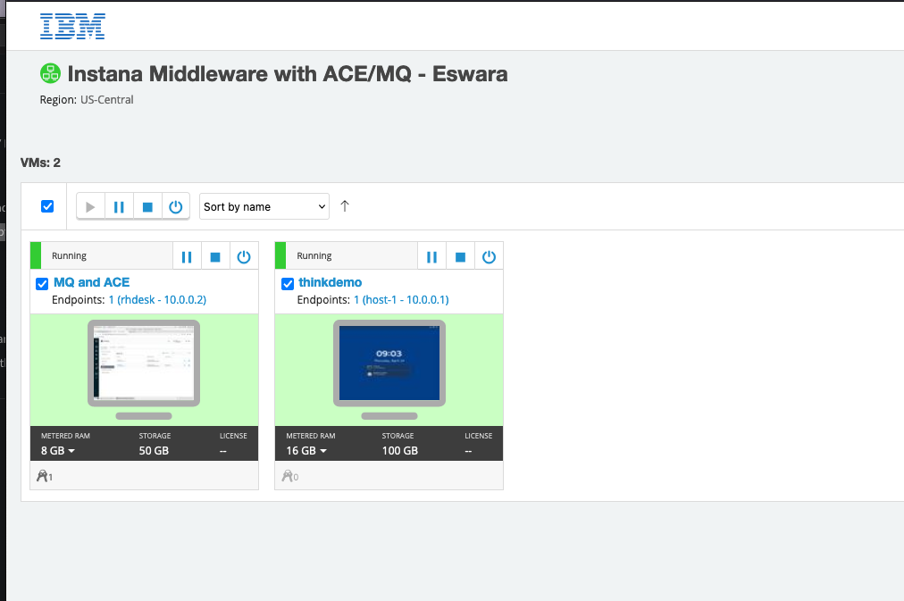

--- 
title: Think Lab 2176
description: Observability of a hybrid application using Instana
---

## Introduction

This lab will allow students to learn how to intrument a hybrid application for observability using Instana.  The application consists 
of a cloud native component running in kubernetes (OpenShift) and a traditional server with IBM MQ and IBM App Connect Enterprise.  
Once instrumented, students will explore the rich set of monitoring data available to monitor the traditional and cloud native infratructure,
the application, and the web traffic.  Students will see how Instana can help them get to root cause quickly and in an intuitive way by
allowing the Instana UI to guide them through the diagnosis.  Students will also learn how to customize the environment and define custom Events.

1) In the first portion of the lab, students will instrument kubernetes and IBM ACE and MQ for monitoring.

2) Once instrumented, students will explore key aspects of the Instana user interface.   Part 1 must be completed before proceding the second
portion of the lab.

3) In the 3rd section of the lab, students will perform a diagnostic scenario in the hybrid application

4) Finally, in the 4th section students will learn how to perform administrative tasks.

After completing the Login section, use the other links to go directly to one of the lab exercises.

We recommend you use Firefox to complete the lab.  If you attempt to use Chrome, you won't be able to accept the certificates.

Select one of the lab exercises in the upper left corner or select one of the images below.

<Row>

<Column colLg={4} colMd={4} noGutterMdLeft>
<ArticleCard
    color="dark"
    subTitle="Installing and Configuring Monitoring"
    title="Install the Instana Monitoring Agent and Configure the Sensors"
    href="/tutorials/Install"
    actionIcon="arrowRight"
    >

</ArticleCard>

</Column>

<Column colLg={4} colMd={4} noGutterMdLeft>
<ArticleCard
    color="dark"
    subTitle="Explorer Instana"
    title="Explore the Instana UI and Capabilities"
    href="/tutorials/Explore"
    actionIcon="arrowRight"
    >

</ArticleCard>
</Column>

<Column colLg={4} colMd={4} noGutterMdLeft>
<ArticleCard
    color="dark"
    subTitle="Diagnose a Problem"
    title="Learn How Instana Can Help you Quickly Diagnose a Complex Problem"
    href="/tutorials/Diagnose"
    actionIcon="arrowRight"
    >

</ArticleCard>
</Column>

<Column colLg={4} colMd={4} noGutterMdLeft>
<ArticleCard
    color="dark"
    subTitle="Administer Instana"
    title="Learn How to Perform Administrative Tasks in Instana"
    href="/tutorials/Console_Access"
    actionIcon="arrowRight"
    >

</ArticleCard>
</Column>
</Row>

***

## Logging into the Environment

  Before beginning the exercises, take the following steps to login to the soleil environment and access the lab environment.

  After opening your browser and logging into the lab, you'll see an image of a two computers.  The first is named thinkdemo. This 
  server is the kubernetes(OpenShift) cluster where the cloud native portion of the application will run.

  

  If the background is green, it means the virtual machine is running.  If it is not running, click the start arrow to start the VM
  

  The 2nd VM is named "MQ and ACE".  This VM is a traditional server running IBM MQ and IBM App Connect Enterprise.
  
  After the VM is running, click the picture of the "thinkdemo" computer to launch the desktop.

  For more information on using the soleil environment, click the link below.

## Using the soleil environment

  Within the desktop, you'll see both Firefox and Chrome browsers.  You will be using the browser to access the user interface
  to perform the automation exercises.  
  
  - Launch the browser of your choice

  - Within the browser interface, you will find the primary Think Lab 2176 and backup Think Lab 20176 bookmarks. Unless instructed otherwise, use the "primary" environment.  The backup environment is only there if there are problems with the primary environment.
  - Select the link to launch the primary lab environment
  - The first time you login, you may be prompted to select a login type.  Select the "Enterprise LDAP" login type as seen below

    

    Note:  The solution supports multipe types of login credentials. This environment is setup with an enterprise LDAP server.

  - The initial screen will be the login panel.  Within your desktop, a username will be assigned to you.  The usernames and passwords
    are as follows:

      student1/waiops-private1
      student2/waiops-private2
      …
      student30/waiops-private30

  - It is important, that you login with your assigned username and password to avoid conflicts with other students.
  - Enter your userid and password and click the "Log in" icon

    

  - Depending on your previous navigation, occasionally, you will be taken to this screen.

    

    If this happens, click the "Cloud Pak for Multicloud Management" URL
  - You are now on the home page and can begin the exercises.  As you move from one lab exercise to another, they all begin from this starting page.  If you lose your place within the browser, you can always use the bookmark within your browser.
    
    

  Next, scroll up, select one of the lab exercises and begin learning to use the Automation capabilities.

***

## Using the soleil environment

  There are a couple of things that are important to know when using the soleil environment.  At the top of the screen you will see a menu bar.  You'll notice a full screen icon as shown below. You'll have a much better experience with the lab if you use full screen.

  

  Another icon on the taskbar that is important is the clipboard icon

  

  The only way to paste content into the virtual machine is by using this icon.

  To copy text into the virtual machine, perform a copy as you normally would do on your laptop/desktop.  Then, click the clipboard icon. You will notice that there is text within the clipboard user interface

  

  This will make the text available within the virtual machine. Then, within the virtual machine, either type "Ctrl-V" or right-click and use your browser to paste the text into the virtual machine.

  To copy text from the virtual machine, do the process in reverse.  Copy the text inside the virtual machine.  Then, click the clipboard icon and you will notice that the text is visible on the screen.

  

  Whatever text you see on the VM clipboard, you'll be able to past within your laptop/desktop.

  Note:  The clipboard is a little bit unreliable.  You may need to attempt to copy/paste a couple of timess.  Also, try to avoid clicking in multiple places on the screen. Copy the content (Ctrl-C), click on the clipboard, then immediately paste to either your laptop or into the virtual machine.
