# Create an Analytics based Smart Alert

In this section, students are going to create an analytics based **"Smart Alert"** to detect abnormal behavior within an application.

Click on Applications.  Then, select the **"Quote of the Day"** application. 

Note, you can't use the application that you just installed for Analytics based threshold because
there isn't enough historical data.
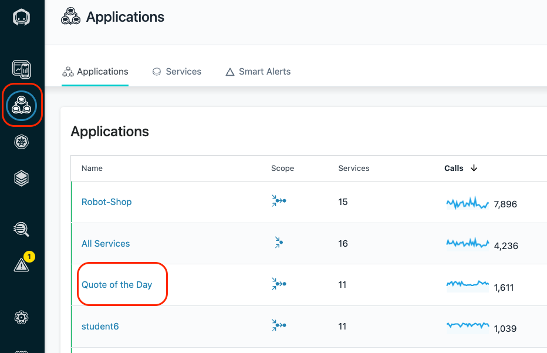

Click on **"Add Smart Alert"** in the lower right corner.

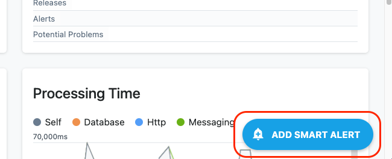

There is a simple and an advanced mode.  We'll be using the advanced mode which allows you to see all of the capabilities.

In the upper right corner of the dialog, select **"Switch to Advanced Mode"**

In the upper left corner, you'll see that there are 4 different types of **Smart Alerts**
- Slow Calls
- Erroneous Calls
- HTTP Status Codes
- Throughput

Leave the default of **"Slow Calls"**
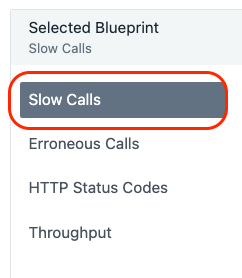

Scroll down.  You'll see that there are number of options to determine which calls you want to analyze.  
- You can analyze the calls for this application or you can analyze specific services or endpoints.
- You can analyze **Inbound Calls** or **All Calls**
- You can include **Internal Calls**
- You can include **Synthetic Calls**

Leave the default settings.

Scroll down further until you see the widgets show in the screen capture below.
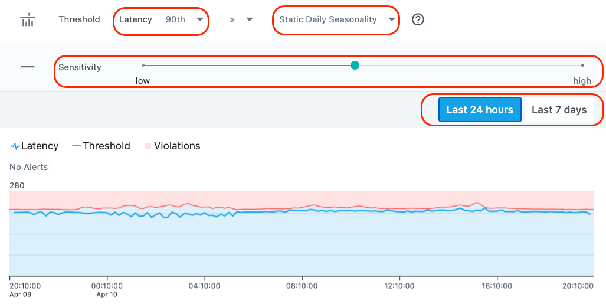

You'll notice that there are a variety of options including:
- The ability to change the percentile that is used for the evaluation
- The type of seasonality (static, daily, or weekly)
- whether you want to view the last 24 hours or 7 days of historical data
- Sensitivity.

Try out some of the options.  In particular, move the slider for sensitivity.  Notice that when you set it to higher sensitivity, some red triangle appear indicating
when thresholds would trigger if you had chosen that setting.
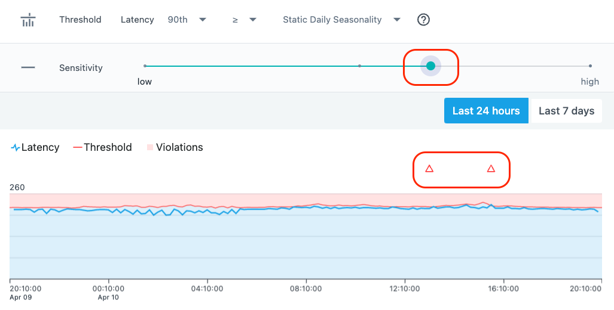

Choose an appropriate value for the sensitivity.  You don't want to receive a lot of alert by setting the sensitivity too high.  Usually, if you see more than 1 or two alerts per day,
the sensitivity is probably too high.  But, it depends on the historical data that you're looking at and the mission criticality of the application.

Scroll down further.
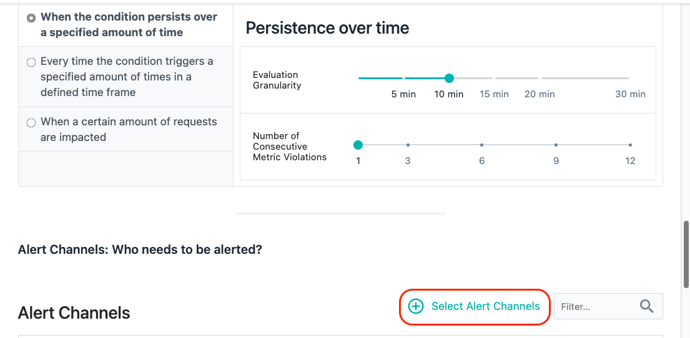

You'll see that there are options for persistence over time.  This ensures that the conditions trigger for a reasonable length of time before an alert is raised.  

There is also an option to select an **"Alert Channel"**.  An **"Alert Channel"** is a way to notify people about the event via different channels such as e-mail, slack, Watson AIOPs, etc.

Select the **"Select Alert Channels"** option.  A dialog will open with a few different **Alert Channels**.  Select one or more channel.  For example, have the alerts sent to the SRE slack channel.

Click on the **"Create Alert Channel"** link in the upper right corner.

Click on the dropdown list for the **"Alert Channel type"**.

You will see a list of all of the **"Channel"** options.  You can setup Alert Channels to slack, e-mail, Watson AIOps, splunk, and more.  There is also a **"Generic Webhook"** option that allows you
to integrate with a variety of 3rd party products that support webhooks.

Don't bother saving your changes.  We just wanted to allow you to see your options for setting up **"Smart Alerts"** and **"Alert Channels"**

Click the **"Cancel"** button at the bottom of the dialog.

Click **"Cancel"** two more times to close the **"Smart Alert"** dialog.

# Create a static threshold (Event)
Now, let's examine how a more traditional threshold is created and used in conjunction with Alert Channels.

On the left side of the screen, select the **"Settings"** gear.

The Settings menu provides access to most of the administrative tasks within Instana.  You'll notice menus for Events, Alerts, Alert Channels, API Tokens, Users, Groups, Log Managemnet Integration, and more

Select **"Events"**

Once you click on **"Events"**, you will see a list of 300+ Events that are defined as out of the box thresholds within Instana.  If you want to filter the list, you can do that in a number of ways
via the drop down lists at the top of the page.

Notice that you can filter based on the Event type, severity, entity type, state, or simply enter a keyword filter.

Let's select **"Entity Type"**

Select the **"Entity Type"** dropdown list and type **"IBM MQ"** into the field.  You'll notice that a few different options show up. Each of the options is an Entity Type.  You can filter 
on the Events related to the IBM MQ Queue Manager, Queue, Channel, etc.

Select **"IBM MQ Queue Manager"** from the dropdown list.

This will filter the Events to the list of Events that are written against the IBM MQ Queue Manager entity type.  There are several out of the box threshold Events that will detect things like
channel initiator status, queue manager status, publish/subscribe engine status, and more.

Let's create a new Event.

At the top of the screen, select the **"+ New Event"** link.
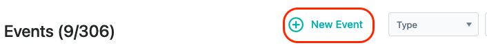

Fill in the following information for you new Event:
- Give your Event a name.  Use your **student name** when creating the Event as seen below.
- Enter a description for the Event
- Select a severity (Warning or critical)
- Select the option of whether you want your Event to get correlated into Incidents
- Select a Grace Period.   
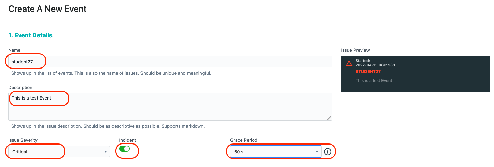

The Grace Period is a capability that allow you to avoid getting multiple alerts during flapping.  Let's say you are monitoring for high CPU utilization on a server.  If CPU utilization goes High, 
then Low, then High over a short period of time, you typically only want to see **ONE** event.  By setting a "Grace Period" of something like 60 seconds, you would only receive 1 Event during that interval.

Now, scroll down a little further and fill in the remaining options.

In the **"Condition"** section, select the dropdown and choose **"Built-in Metrics"**.  Most of your thresholds will be written against these **Built-in Metrics**.  
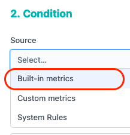

The choice of "Custom metrics" would only apply to custom metrics that are being fed into Instana.  The "System Rules" are a specialized set of rules for doing thing like detecting that an 
entity is **"offline"**.

Once you select **"Built-in Metrics"** another dropdown list will appear.  The new dropdown list is asking for the **"Entity type"** that you are going to write your threshold against.

In the **"Entity type"** dropdown, select **"IBM MQ Queue"**.  Notice that you can type in letters such as "IBM MQ" to filter the list.
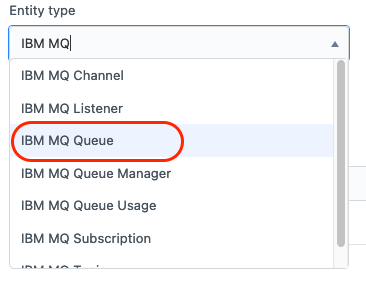

After specifying an **"Entity type"**, a new dropdown appears with a list of available **"Metrics"**.  Select the **"Metric"** dropdown and choose **"Depth > Queue Depth Percentage"**.
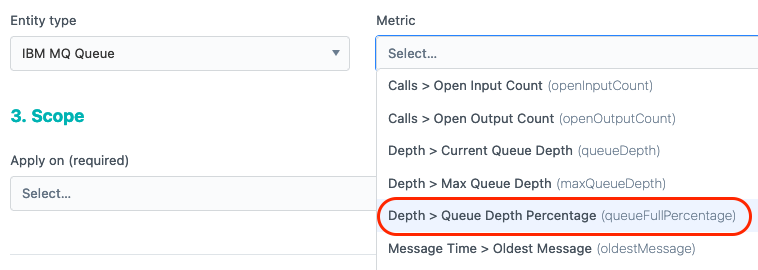

After making your select, some new dropdowns appear on the screen looking for the following information:
- Time Window:  This is the duration that you want to monitor and evaluate
- Aggregation:  Since Instana is capture data at a high interval, you can use Min, Max, Avg, Sum as part of your evaluation.  
- Operator: What type of evaluation do you want to do (>, < =, etc.)
- Percentage - This field is actually different depending on the metric you are evaluating. In this case, you are evaluating a metric that is a percentage.

In the dropdowns, choose **"60 s"** for the time window, **"max"** for the Aggregation, **">"** for the Operator, and **"90"** for the Percentage.
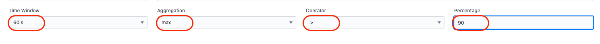

You have now completed the section of the lab on automating tasks in VMware environments.

In this portion of the lab, you saw how easy it is for an end user to provision complex services that can provision virtual machine, clusters, install applications, and more.  You learned how to modify and customize a service.  You explored the capabilities within the service composer which allows you to combine Terraform, Ansible, Rest Hooks, ServiceNow, and more into complex workflows.  Finally, you learned how to publish your Service so that other users can execute the Service and provision VMware virtual machines.

To continue other portions of the lab, select one of the lab exercises in the upper left corner or select one of the images below.

<Row>

<Column colLg={4} colMd={4} noGutterMdLeft>
<ArticleCard
    color="dark"
    subTitle="Installing and Configuring Monitoring"
    title="Install the Instana Monitoring Agent and Configure the Sensors"
    href="/tutorials/Install"
    actionIcon="arrowRight"
    >

</ArticleCard>

</Column>

<Column colLg={4} colMd={4} noGutterMdLeft>
<ArticleCard
    color="dark"
    subTitle="Explorer Instana"
    title="Explore the Instana UI and Capabilities"
    href="/tutorials/Explore"
    actionIcon="arrowRight"
    >

</ArticleCard>
</Column>

<Column colLg={4} colMd={4} noGutterMdLeft>
<ArticleCard
    color="dark"
    subTitle="Diagnose a Problem"
    title="Learn How Instana Can Help you Quickly Diagnose a Complex Problem"
    href="/tutorials/Diagnose"
    actionIcon="arrowRight"
    >

</ArticleCard>
</Column>

</Row>

***
