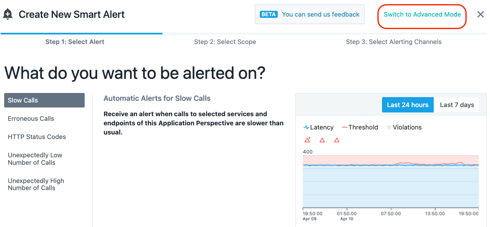
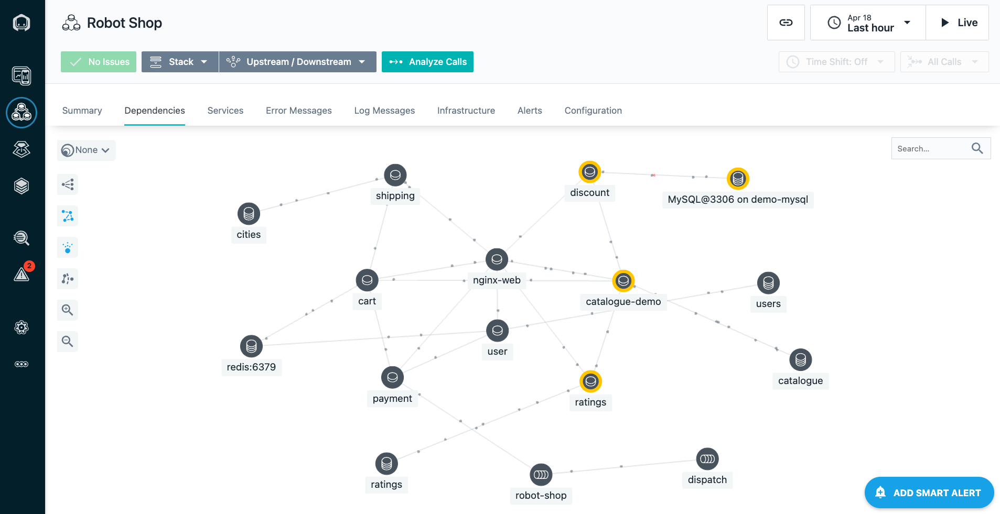

# Create an Analytics based Smart Alert

Click on Applications.  Then, select the **"Quote of the Day"** application. We can't use the application that you just installed for Analytics based threshold because
there isn't enough historical data.

Click on **"Add Smart Alert"** in the lower right corner.

There is a simple and an advanced mode.  The advanced mode will allow you to see all of the capabilities.

In the upper right corner of the dialog, select **"Switch to Advanced Mode"**

In the upper left corner, you'll see that there are 4 different types of **Smart Alerts**
- Slow Calls
- Erroneous Calls
- HTTP Status Codes
- Throughput

Leave the default of **"Slow Calls"**

Scroll down.  You'll see that there are number of options on which calls you want to analyze.  
- You can analyze the calls for this application or you can analyze specific services or endpoints.
- You can analyze **Inbound Calls** or **All Calls**
- You can include **Internal Calls**
- You can include **Synthetic Calls**

Leave the default settings.

Scroll down further until you see the widgets show in the screen capture below.

You'll notice that there are a variety of options including:
- The ability to change the percentile that is used for the evaluation
- The type of seasonality (static, daily, or weekly)
- whether you want to view the last 24 hours or 7 days of historical data
- Sensitivity.

Try out some of the options.  In particular, move the slider for sensitivity.  Notice that when you set it to higher sensitivity, some red triangle appear indicating
when thresholds would trigger if you choose that setting.

Choose an appropriate value for the sensitivity.  You don't want to receive a lot of alert by setting the sensitivity too high.  Usually, if you see more than 1 or two alerts per day,
the sensitivity is probably too high.  But, it depends on the historical data that you're looking at.

Scroll down further.

You'll see that there are options for persistence over time.  This ensures that the conditions trigger for a reasonable length of time before an alert is raised.  

There is also an option to select an **"Alert Channel"**.  An **"Alert Channel"** is a way to notify people about the event via different channels such as e-mail, slack, etc.

Select the **"Select Alert Channels"** option.  A dialog will open with a few different **Alert Channels**.  Select one or more channel.  For example, have the alerts sent to the SRE slack channel.

Click on the *"Create Alert Channel"** link in the upper right corner.

Click on the dropdown list for the **"Alert Channel type"**.

You will see a list of all of the **"Channel"** options.  You can setup Alert Channels to slack, e-mail, Watson AIOps, splunk, and more.  There is also a **"Generic Webhook"** option that allows you
to integrate with a variety of 3rd party products that support webhooks.

Don't bother saving your changes.  We just wanted to allow you to see your options for setting up **"Smart Alerts"** and **"Alert Channels"**

Click the **"Cancel"** button at the bottom of the dialog.

Click **"Cancel"** two more times to **"Smart Alert"** dialog.

You have now completed the section of the lab on automating tasks in VMware environments.

In this portion of the lab, you saw how easy it is for an end user to provision complex services that can provision virtual machine, clusters, install applications, and more.  You learned how to modify and customize a service.  You explored the capabilities within the service composer which allows you to combine Terraform, Ansible, Rest Hooks, ServiceNow, and more into complex workflows.  Finally, you learned how to publish your Service so that other users can execute the Service and provision VMware virtual machines.

To continue other portions of the lab, select one of the lab exercises in the upper left corner or select one of the images below.

<Row>

<Column colLg={4} colMd={4} noGutterMdLeft>
<ArticleCard
    color="dark"
    subTitle="Installing and Configuring Monitoring"
    title="Install the Instana Monitoring Agent and Configure the Sensors"
    href="/tutorials/Install"
    actionIcon="arrowRight"
    >

</ArticleCard>

</Column>

<Column colLg={4} colMd={4} noGutterMdLeft>
<ArticleCard
    color="dark"
    subTitle="Explorer Instana"
    title="Explore the Instana UI and Capabilities"
    href="/tutorials/Explore"
    actionIcon="arrowRight"
    >

</ArticleCard>
</Column>

<Column colLg={4} colMd={4} noGutterMdLeft>
<ArticleCard
    color="dark"
    subTitle="Diagnose a Problem"
    title="Learn How Instana Can Help you Quickly Diagnose a Complex Problem"
    href="/tutorials/Diagnose"
    actionIcon="arrowRight"
    >

</ArticleCard>
</Column>

</Row>

***
