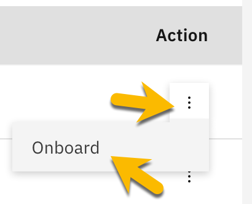
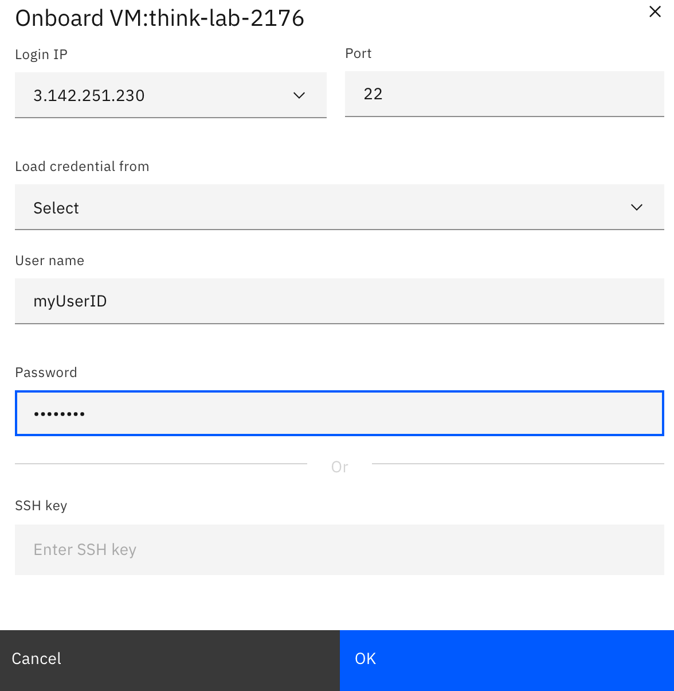
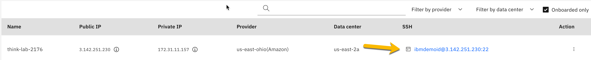
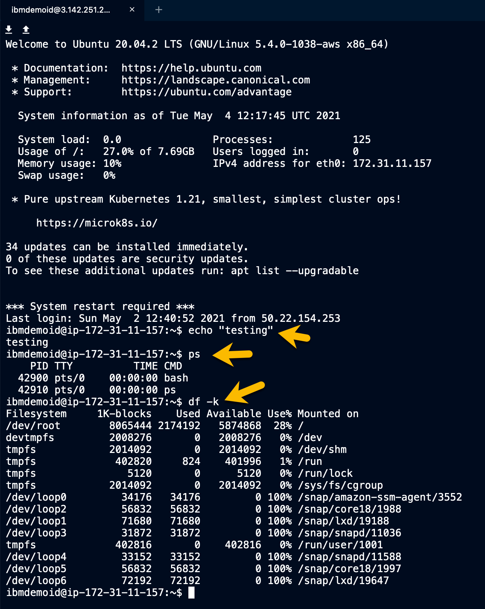
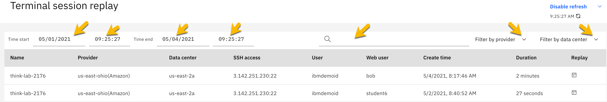
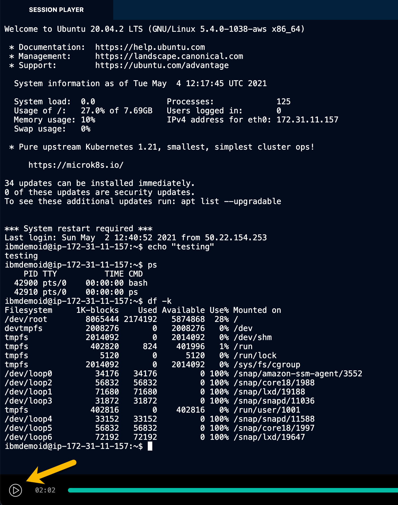

# Title Think Lab 2176 - Console Access

In this exercise you will learn about Cloud Pak for Multicloud Management's Console Access.  It simplifies the troubleshooting process across regions and deployment models with increased visualization and remediation tools.

1) Begin by selecting the hamburger menu in the upper left corner 

></img>

2) From the dropdown menu, select "Take action" and then "Console access"

></img>

3) This Step was already performed for you, review ONLY. 
   > a) As an administrator, you could "Onboard" a server for console access.  This process involves clicking onto the vertical "..." and then select "Onboard"
</img>
    
   > b) Provide the required credential information i.e. Your user ID, Password or SSH key.  Login credentials can be saved for later usage in Hashicorp Vault, an open source tool for secrets management, encryption, and privileged access management.
</img>

4) You can search for a server by name (think-lab-2176), or you can click on "Onboard only" checkbox to filter the list of servers shown.  Or, use a combination of both filters for a large environment.  

>

5) On the Console access page, you can open an SSH-over-HTTPS session by clicking onto the link under the SSH column to access the terminal for the particular server (think-lab-2176) from IBM Cloud Pak console.

>

>NOTE: Please lookout for popup blocker.  You can open the window by clicking "Preference" and then the link "Show https:/..."
>

6) Once the console screen opens, you can run various commands supported by the remote system i.e echo "testing", ps, df -k, etc.  If you were troubeshooting an issue, you could see what process is running, filesystem usage, or run commands that perform various tasks i.e clean up files/directory, restart a process, etc.  On this environment you'll have limited access.

>

7) You can close your remote session or you may have noticed that it disconnects after an inactivity period.

# Title Think Lab 2176 - Terminal Session Replay
Terminal Session replay/audit: You can replay a terminal session as you need. In this way, you can avoid duplicate actions among your team, collaborate in a more efficient way, and thus accelerate troubleshooting and problem resolution process. In addition, you can check what everyone does in SSH sessions for auditing considerations.

1) Begin by selecting the hamburger menu in the upper left corner 

></img>

2) From the dropdown menu, select "Take action" and then "Terminal session replay"
></img>

3) You can filter the session activity between two dates/times, you can search for a specific user, filter based on provider, and/or datacenter.

>

4) Once you find a session of interest, you can click on the play button under the Replay column.
>

5) The selected session's video should auto play, however, you can play/pause the video by clicking on the play/pause button.
>

That completes this section of the lab.

In this portion of the lab, you saw how easy it is to quickly gain console access to rapidly troubleshoot an issue or run commands on a specific system.  And, you see how easy it is to audit the actions performed during a given session.

