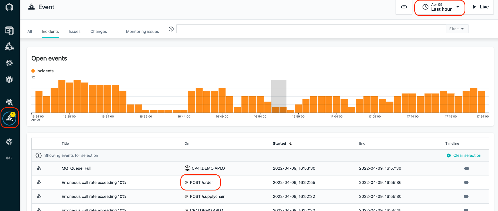
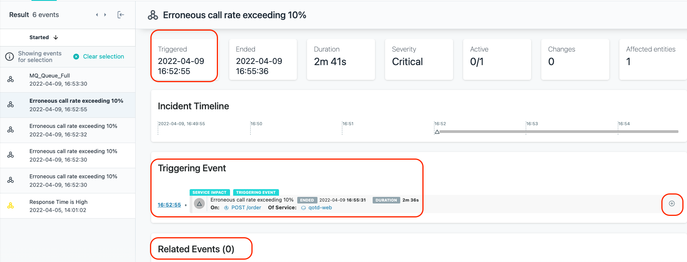
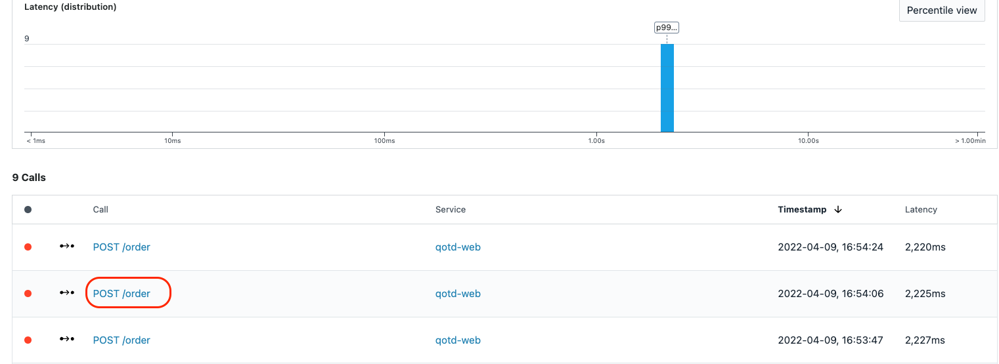
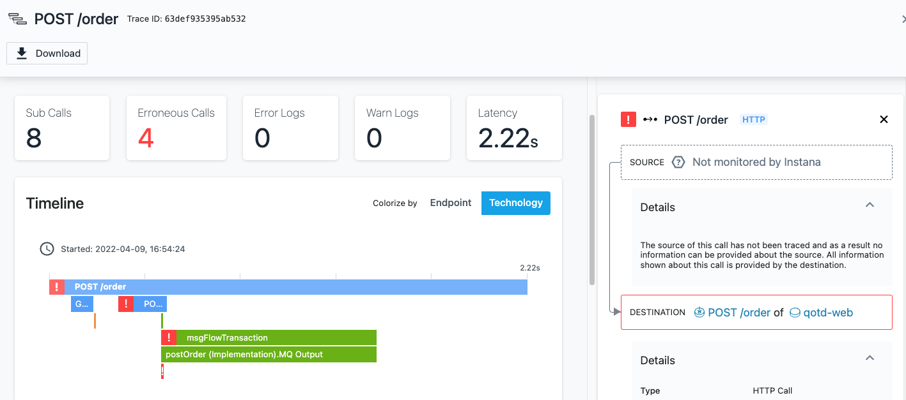
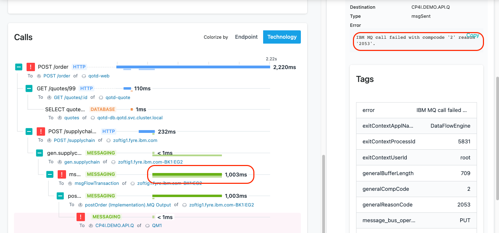

In this section of the lab, you will learn how Instana can help you get to root cause of a problem in a quick and intuitive manner.

On the left side, select **"Events"**

This will open up a panel showing all of the Incidents that are affecting the monitored systems and applications. Incidents are the raw Events that have been correlated via
Analytics into an Incident. 

Make sure that the time selection in the upper right corner is set to **"Last hour"**

Select the Incident that is triggering on the **"POST /order"** request.

In this case, only a single Event makes up the Incident, but in many cases, you will see 8 or 10 Events that are related to each other contained within a single Incident.

Within the Incident, you can see when the Incident opened and in some cases, when it closed. 

You will see the "Triggering Event" and any "Related Events"

On the right side, click on the **"+"** symbol to expand the Triggering Event.

You can see in the historical graph that the erroneous calls reached 100% for a period of time.

Next, click the **"Analyze Calls"** button to analyze the calls.

You will be taken to an analytics screen where you can all of the failed calls for **"POST /order"** . You can also see latency for the calls is greater than 2 seconds.

Select one of the **"POST /order"** calls

You will be taken to a screen where you can see the Call Stack and Stack Trace data. You explored this previously, but you did it with a good transaction.  Now you are 
examining a failed transaction.

Scroll to the bottom of the page where you see the **"Calls"**

When you see errors, normally you go to the bottom of the call stack.  That's because the error in the last call is likely affecting the upstream calls.  

Click on the last call and examine the information on the right side.

You will see the following error message:  **"IBM MQ call failed with compcode '2' reason '2053"**

This error message indicates that the MQ Queue is full and new messages can't be put on the queue.  In the future, Instana will be providing a translated error message for 
key messages like this so that you don't have to lookup the error codes.

Now, scroll all the way to the bottom on the right side of the screen.  You'll see that there is a link that will link to the MQ Queue named CP4I.DEMO.API.Q.

Click on the link to navigate to the queue details.

On this screen, you'll notice a few important things.
- In the upper right corner, you'll notice that the time range is specifically set to the timeframe when the Incident was open.
- The queue depth is at 100%
- No messages are going in our out of the queue.

Clearly there is a problem with this queue.  The queue is full and transactions won't work properly because new message ban't be placed on the queue.  We need to resolve the queue depth problem in order to fix the application.

That completes this section of the lab.

In this portion of the lab, you learned out to diagnose a problem in Instana.  Ultimately, determining that the queue was full and preventing transactions from completing.

To continue other portions of the lab, select one of the lab exercises in the upper left corner or select one of the images below.

<Row>

<Column colLg={4} colMd={4} noGutterMdLeft>
<ArticleCard
    color="dark"
    subTitle="Installing and Configuring Monitoring"
    title="Install the Instana Monitoring Agent and Configure the Sensors"
    href="/tutorials/Install"
    actionIcon="arrowRight"
    >

</ArticleCard>

</Column>

<Column colLg={4} colMd={4} noGutterMdLeft>
<ArticleCard
    color="dark"
    subTitle="Explorer Instana"
    title="Explore the Instana UI and Capabilities"
    href="/tutorials/Explore"
    actionIcon="arrowRight"
    >

</ArticleCard>
</Column>

<Column colLg={4} colMd={4} noGutterMdLeft>
<ArticleCard
    color="dark"
    subTitle="Administer Instana"
    title="Learn How to Perform Administrative Tasks in Instana"
    href="/tutorials/Console_Access"
    actionIcon="arrowRight"
    >

</ArticleCard>
</Column>
</Row>