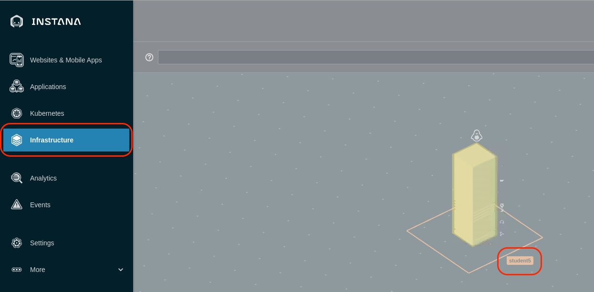

<FeatureCard title="Explore Instana and the Quote of the Day Application" color="dark">
  
</FeatureCard>

<AnchorLinks>
  <AnchorLink>Explore kubernetes</AnchorLink>
  <AnchorLink>Explore the Infrasture View</AnchorLink>
  <AnchorLink>Exploring the cloud providers</AnchorLink>
  <AnchorLink>Exploring GRC dashboard</AnchorLink>  
  <AnchorLink>Summary</AnchorLink>
</AnchorLinks>

***

## Explore Kubernetes

Open the browser tab for the Instana user interface.

On the left navigation, select "kubernetes"
  

You will see a list of kubernetes clusters.   Look for the Cluster with your student name.  If you don't see your student name, you may need to wait a couple of minutes.

If you don't see your student name after a couple of minutes, we need to troubleshoot the Instana Agent.  From a terminal window, issue the following command:
oc get pods -n instana-agent

Check to make sure that all pods are running.

If all pods are running, we need examine the logs of one of the pods.

Type:  oc logs **POD_NAME** -c instana-agent
where **POD_NAME** is one of the pods listed in the previous command.

Assuming that your cluster name shows up properly, click on the link for "student***".

You should see a screen similar to the one below where you can see overall utilization of the kubernetes cluster.
  

Select some of the other tabs to explore the kubernetes monitoring.  We recommend you look at the Events, Nodes, and Pods tabs.  When you select the pods tab, you will see a list of all pods running within the cluster.

In the upper right corner, add your student name into the search widget.  You'll notice that it will filter the list to the pods related to the Quote of the Day application.
  


***

## Explore the Infrastructure View

Next, explore the Infrastructure view.  To do this, click on the "Infrastructure" icon on the left side.
  

 You'll notice that there is a square surrounding one of the servers with your student name.  The square is a "zone".  If you recall, you specified a zone name when you
 performed the yaml based install of the Instana Agent.  The box contained within the square represents the OpenShift worker node.  This is a single server OpenShift environment.
 If this was a more typically environment, you would see more cubes, one for each worker node.


### Exploring the cloud providers

  Log in to the Cloud Pak user interface with your assigned user id (studentX). From the "hamburger" menu in the top-left corner select **Automate infrastructure -> Infrastructure management**


  New browser tab opens with Infrastructure management user interface. Here, depending on the assigned permissions you can view and manage virtual machines in any of the connected environments. Let's explore infrastructure in public clouds. From the left-hand side menu select **Compute -> Cloud -> Providers**


  You should see some public cloud regions from different public providers registered. Due to the fact, that this is a shared environment you cannot edit the providers, but you should know that IBM Cloud Pak for Watson AIOps Infrastructure Management currently supports the following clouds:

  - Amazon EC2
  - Google Cloud Engine
  - IBM Cloud
  - Microsoft Azure
  - Microsoft Azure Stack
  - Openstack
  - VMware vCloud

 

  Additional providers are planned for second half of 2021

  Click any of the available providers (for example us-east-ohio). You will see details of all resources provisioned in selected region (to which you have access rights assigned). To explore further, click the **Instances**.


  If you cannot see any instances on the list, it means that your access rights are limited. 
  


  You can click any instance to look at the details.


  Let's provision some new instances in IBM Cloud.

### Exploring the service library

  Go back to the main browser tab **IBM Cloud Pak for ...**. This time from the "hamburger" menu select **Automate infrastructure -> Manage services**.

  In case you access this module for the first time, "Welcome" screen may pop-up. If that happens, click the **Service library** link.


  In the Service Library view you can see all services defined in the Cloud Pak. On the left you can see different service categories (1), on the right list of all services in a selected category (2). On top, there are additional tabs, where you can define the terraform templates for your environment (3). This tab is explored more in VMware lab. Here you will work with the already defined service.


  Unfold versions of the **IBMCloud-2Node-App** service (1), then click  **three dots** icon on the right in the **(default)** row (2), and select **View** (3).

  This view shows all the details of the service. Click the **Composition** tab to see the provisioning flow.


  You can see that service flow includes two tasks:
  - a terraform template **ibmcloud-vpc-thinklab**, and
  - Ansible inventory task


  First task provisions a terraform template in IBM Cloud (To see the source code of the template click this [link](https://github.com/dymaczew/cmh-test-github/tree/master/terraform/ibmcloud-vpc-thinklab)) When it completes, the second one registers newly provisioned VMs in Ansible inventory so you can run the configuration tasks against them. Let's add an Ansible task to the flow. Since the service is already published, to modify it you have to first create a new version. Go back to the **Service Library** view.


  In the row **IBMCloud-2Node-App** click the **3 dots** icon on the right, and select **Add version**.


  Provide unique version name (1) - for example provide your student id number as a last field. Notice, that the version number must be in a format X.Y.Z.V. Finally, click **Add** (2).


  New version of the service is opened in Service editor. Go to the **Composition** tab (1), unfold the available ansible tasks on the left (2) and drag-and-drop **Configure Nginx** task next to the Ansible inventory task in the flow (3). 


  This is a very simple Ansible playbook available [here](https://github.com/dymaczew/rba-ansible-sample/blob/master/nginx.yaml), which was imported into connected Ansible tower and exposed as a Template (All templates  you create in connected Ansible Tower are automatically shown in the Service Editor). For covenience, the source code was also shown below:

  ```yaml
    ---
    - name: Install nginx
      hosts: all
      gather_facts: False
      become: true

      vars:
       - MyMessage: "Welcome to Think Lab 2176 instance!"

      tasks:
      - name: Add epel-release repo
        yum:
          name: epel-release
          state: present

      - name: Install nginx
        yum:
          name: nginx
          state: present

      - name: Insert Index Page
        template:
          src: index.html.j2
          dest: /usr/share/nginx/html/index.html

      - file:
          path: /usr/share/nginx/html/index.html
          mode: 0644

      - name: Start NGiNX
        service:
          name: nginx
          state: started
  ```

  Click the newly added task to edit parameters.


  There are three parameters available:

  - inventory name
  - credentials
  - extra variables (to be passed to Ansible playbook - for simplicity our task does not require any parameters)

  Click **inventory_name** link (1) and then click **Link parameter** (2).


  Instead of providing the static value, you will link as input the output value from the previous **Ansible inventory** task. Pick **Ansible** (1) and unfold the **Inventory** task parameters (2).


  Scroll down and select **inventory_name (output)** (1). To create a linkage click the '+' sign next to the parameter name. Then, click **Save** (2).


  As a second required parameter **credential_name** provide the static value "default-ssh-key" and click **Save**. In our lab setup, each virtual machine is provisioned with SSH key embedded in a template, and Ansible Tower that is used for automating the configuration tasks, has a matching private key stored with this name. Alternatively, you could add **Ansible Credentials** task in the flow to create a credentials dynamically, but we wanted to simplify the flow for the time sake.


  When both parameters are in place, click the **Save** button on the top. Then, click "three dots" icon next to Publish button and select **Test deploy**.


  Provisioning dialog opens. Click **Next**.

  Provide the required parameters. For **service name** (1) and **prefix** (2) provide a unique name (for example your user id - this will help you identify your instance among all VMs provisioned by other students). For **Public ssh key** (3) you have to provide a public ssh key to be injected into the Virtual machines. Since all the students are using the jump workstation generated from the same template, to avoid duplicates let's generate a new one. Open the Terminal window (link should be on the Desktop - you may need to minimize the browser to see it) and run the following command (hit ENTER twice when prompted for passphrase):

  ```sh
  ssh-keygen -t rsa -f student
  ```

  Sample output should look like below:

  ```sh
  ssh-keygen -t rsa -f student
  Generating public/private rsa key pair.
  Enter passphrase (empty for no passphrase): 
  Enter same passphrase again: 
  Your identification has been saved in student.
  Your public key has been saved in student.pub.
  The key fingerprint is:
  SHA256:ttvYM7oiJjgOFW+wuRhUYU/OGQdMlEilArmV12zsMS8 dymaczew@Wlodeks-MBP
  The keys randomart image is:
  +---[RSA 3072]----+
  |...*B@o.         |
  |o =.Bo@          |
  | =oo B +         |
  |o .*  E .        |
  |. + o  .S        |
  | + o   . .       |
  |o..     .        |
  |+ . o .  =o      |
  |.o o . .=ooo     |
  +----[SHA256]-----+
  ```

  List the content of **student.pub** file (cat student.pub) and copy the key to the provisioning dialog in the **Public SSH key** field. You can change **Environment** type (4) - that will be dynamically mapped to the filters in the Infrastructure management UI. Finally hit **Deploy** button (5).


  On the Order confirmation dialog select **Go to instances** to verify the provisioning process.


***

## Summary

  In this exercise you have modified the service definition to combine provisioning of infrastructure in public cloud using Terraform template with the configuration task leveraging Ansible playbook. You have also explored the capability to define and report configuration compliance policies for virtual machines.


To continue other portions of the lab, select one of the lab exercises in the upper left corner or select one of the images below.


<Row>

<Column colLg={4} colMd={4} noGutterMdLeft>
<ArticleCard
    color="dark"
    subTitle="Installing and Configuring Monitoring"
    title="Install the Instana Monitoring Agent and Configure the Sensors"
    href="/tutorials/Install"
    actionIcon="arrowRight"
    >


</ArticleCard>

</Column>

<Column colLg={4} colMd={4} noGutterMdLeft>
<ArticleCard
    color="dark"
    subTitle="Diagnose a Problem"
    title="Learn How Instana Can Help you Quickly Diagnose a Complex Problem"
    href="/tutorials/Diagnose"
    actionIcon="arrowRight"
    >


</ArticleCard>
</Column>

<Column colLg={4} colMd={4} noGutterMdLeft>
<ArticleCard
    color="dark"
    subTitle="Administer Instana"
    title="Learn How to Perform Administrative Tasks in Instana"
    href="/tutorials/Console_Access"
    actionIcon="arrowRight"
    >


</ArticleCard>
</Column>
</Row>