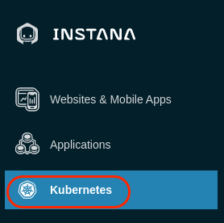
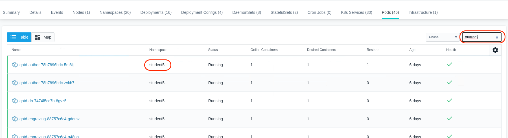
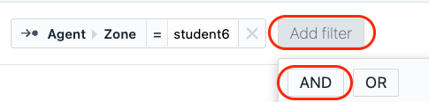
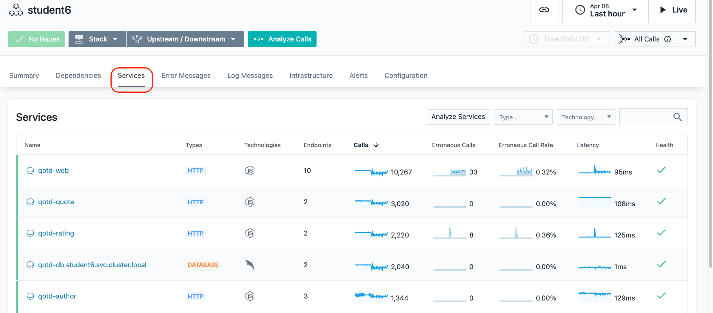
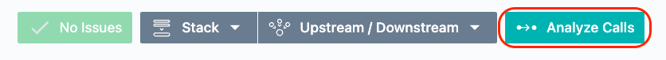

<AnchorLinks>
  <AnchorLink>Explore kubernetes</AnchorLink>
  <AnchorLink>Explore the Infrasture View</AnchorLink>
  <AnchorLink>Exploring the Applications</AnchorLink>
  <AnchorLink>Exploring GRC dashboard</AnchorLink>  
  <AnchorLink>Summary</AnchorLink>
</AnchorLinks>

***

## Explore Kubernetes

Open the browser tab for the Instana user interface.

On the left navigation, select "kubernetes"
  

You will see a list of kubernetes clusters.   Look for the Cluster with your student name.  If you don't see your student name, you may need to wait a couple of minutes.
  

If you don't see your student name after a couple of minutes, we need to troubleshoot the Instana Agent.  From a terminal window, issue the following command:
```sh
oc get pods -n instana-agent
```

Check to make sure that all pods are running.

If all pods are running, we need examine the logs of one of the pods.

Type:  
```sh
oc logs POD_NAME -c instana-agent
```
where **POD_NAME** is one of the pods listed in the previous command.

Assuming that your cluster name shows up properly, click on the link for your student name.

You should see a screen similar to the one below where you can see overall utilization of the kubernetes cluster.
  

Select some of the other tabs to explore the kubernetes monitoring.  We recommend you look at the Events, Nodes, and Pods tabs.  When you select the pods tab, you will see a list of all pods running within the cluster.

In the upper right corner, add your student name into the search widget.  You'll notice that it will filter the list to the pods related to the Quote of the Day application.
  


***

## Explore the Infrastructure View

Next, explore the Infrastructure view.  To do this, click on the "Infrastructure" icon on the left side.
  

Look for your student name.  You'll notice that there is a square surrounding two "towers" with your student name.  The square is a "zone".  If you recall, you 
specified a zone name when you performed the yaml based install of the Instana Agent.  The towers contained within the square represents the OpenShift worker node and the 
virtual machine running ACE and MQ. 

If this was a more typically kubernetes environment, you would see more cubes, one for each worker node.  Notice the k8s-bstern2 zone.  This is a cluster with three worker nodes.

If you are unable to find your zone due to the large number of students, you can type your student name in the filter bar at the top
   

Or, you can use the lucene query language in the search bar.
- Flyover the filter bar and select "Entity"
- A list will popup. Find and select "Host"
- Once you have select "Host", another list will popup. Select "name"
- Now, you will see "entity.host.name:".  After the ":", you can do a wildcard search.  For example "entity.host.name:student*"

Once you have found your zone, flyover the tower that represents your worker node.  The taller tower is the worker node.  It is taller because there are more discovered entities 
running on that server.
   

You'll notice that a number of components were automatically discovered and are instrumented for monitoring.

Next, flyover the other tower.  
   

This is the ACE and MQ server. You can see the MQ and ACE components along with a discovered JVM, a python app, and more.

In the bottom right corner there are several icons that allow you to organize the Infrastructure view in different ways.  For example, group the servers by OS architecture.
  

We recommend you explore those at the end of the lab if time permits.

Next, click on the "Comparison Table" near the top of the page.
  

This table shows a sortable and searchable list of the Hosts that make up this environment.  You can quickly find hosts consuming high CPU, high memory, or have poor health.

In addition, if you select where is says **"Hosts"**, there is a dropdown list that allows you to see lists of JVMs, containers, etc.
  

Change from **"Hosts"** to **"Docker Containers"** in the dropdown list and you'll see a complete list of containers and their utilization and health.

Switch back to the Map view by clicking on "Map" near the upper left corner.
  

Zoom in with the plus sign in the bottom right corner.
  

You'll notice that each tower is actually comprised of multiple pizza boxes.   Each one represents an "Entity" such as an MQ Queue Manager or an ACE Integration Node.
  

Flyover the ACE/MQ server again until you see a list of all discovered Entities.  If you only see 1 entity, move your mouse to one of the corners of the tower.
Once you see all of the entities, click your mouse.  You'll see a dialog open 
  

Use the scroll bar to scroll down. You'll notice that you see each of the types of Entities that were discovered.  Expand the MQ entity type and you'll see the Queue
Manager that was discovered.
  

It is possible to click on either the "Open Dashboard" button or the links for the individual entities.  If you clicked, you could navigate to either the Host 
operating system metrics or the specific middleware entity.

Click on the "Open Dashboard" button and we'll examine the Host Agent dashboard.  After you click on the botton you'll see a screen that looks like this:
  

You can see fine grained metric data for the Host operating system. Scroll down and explore the other metrics.

As you scroll down the page, you'll notice a section on the left side of the screen that contains a list of Entity types that were discovered. This is the same list that you 
saw earlier on the Infrastructure view.
  
Expand the IBM MQ Queue Manager section and select the link for the **QM1@acemq.tivlab.raleigh.ibm.com** queue manager

You will navigate to the dashboard for the MQ Queue Manager. Scroll down the page and examine the metrics.  There are many tables that contain links that would allow you to
drill into the listener, topics, queues, channels, and more.  Let's focus on the Channels.  Scroll down to the table labeled "Channels".  You will notice two channels with the
same name. One represents loopback and the other represents the server IP Address.   Select the link next to the one with connection name 10.0.0.3.
  

Examine the Channel metrics on the page.

Next, look at the top of the screen.  You'll notice that this is a breadcrumb that allows you to navigate back to where you were earlier in your nativations.   It is also
possible to use the back button in your browser.
  

If time permits at the end of the lab, you can explore some of the other elements within the MQ sensor or other middleware such as ACE.


### Create Application Perspective

On the left hand navigation, select "Applications". You will see a screen open up that contains a list of all applications that are defined in the environment.  Initially, this
this will be small until the students in the class define their applications.  
  

The next thing you are going to do is define an application.  You will see an "Add" button in the bottom right corner. 
  

Click on the **"Add"** button

A dialog will open with two options.  We'll examine the "Global Smart Alerts" in the Administrative section of this lab.  For now, click on the "New Application Perspective" button
  

When the dialog opens, click the "Next" button
  

On the next screen, click the radio button for "All downstream services".  This will ensure that all of the downstream calls for the application will be monitored in this 
Application Perspective.

Next, click the **"Add filter"** button.

You will see list of filter options.  Select the option labeled "Zone"
  

Then, click on the **"value"** field that is next to the "Zone".  You should see a list of Zones including your student name.  Select your student name or type the name 
in the entry box.
  

Now, click the **"Add filter"** button and select **"AND"**
  

Select **"Add filter"** again.  Then, in the search field type the word **"endpoint"**.  After typing the word **"endpoint"**, you will see an entry "Endpoint Name".  

Select **"Endpoint Name"**
  

A dropdown list will appear.  If it doesn't, click on the **"Value"** field.  In the dropdown list, find and then select the entry for **"GET /health"**.
  

Finally, select the **"="** symbol and select **"!= (does not equal)"** from the drop down list.
  

This last filter is going to all you to filter out the **"GET /health"** requests which are just kubernetes health checks and are unrelated to the application transactions.

You screen should now look like this:
  

Click **"Next"** to go to the next screen.
  

On the next page, give the name of your Application Perspect your student name.  For example, **"student6"**.  Then, click the "All Calls" radio button to monitor all calls.  Then, click the "Create" button to create your Application Perspective.
  

You have now created an Application Perspective. In the next section, you'll explore the application.


### Explore the Application

After creating the application, your screen should have automatically changed context to show the student** Application Perspective that you just defined.

Initially, you probably won't see any metrics on the screen.  In the upper right corner, click the "Live" button and within a short amount of time you should start
to see metrics in the widgets.
  

On this page you can see the transaction volumes, the number of erroneous calls, latency, and the top services that make up the application.

You'll notice a number of tabs across the top of the screen.  Explore these tabs.  In particular, let's take a look at the **"Depedencies"** tab.

On the dependencies tab, you'll see a full topology of the application services.  This topology is discovered automatically.  You can see transactions flowing between
the different nodes in the topology.   Most of these services are node.js based cloud-native services. The "acemq.tivlab.raleigh.ibm.com-BK1:EG2" is the ACE 
integration node named BK1 and Integration Server named EG2.   The QM1 node in the topology is the MQ Queue Manager named "MQ1".

Click on the QM1 node.  Notice that there are 3 options that would allow you to navigate to the MQ dashboard, the transaction Flow within MQ, or analyze the transaction
calls through MQ.

Click on "Upstream/Downsteam" near the top of the page.  This will allow you to see a list of Upstream and Downstream services for the application.
  

Click on "Stack" where you can view the Application, Kubernetes, and Infrastructure stack that makes up the application.
  

All of this contextual and relationship data helps you analyze and debug you applications to get to root cause as quickly as possible.  In addition, our built 
analytics uses this data to automatically group multiple Events into a single Incident for diagnosis.

Close the **Stack** dialog by either clicking on the **Stack** button or somewhere else on the background of the Instana GUI.

Click on the Services Tab
  

You will see a list of services that make up the application.

Scroll down on the page until you see the **"qotd-engraving"** service.

Click on the **qotd-engraving** link on the left Column.  The qotd-engraving service is the services that calls and ACE flow and then puts a message on the MQ queue. 
We want to explore this service in more detail.
  


Next, click on the "Analyze Calls" button to analyze the individual transactions that are executing in the system.
  

This will take you to a screen showing all of the different types of calls taking place within the qotd-engraving service.  At the top, there is a summary of all calls in terms of
transaction rates, return codes, erroneous calls, and latency.

On the right side, click the arrow to expand the list of qotd-engraving **"POST /order" calls.  Instana is capturing 100% of the transactions so that you don't miss intermittent problems that might be occurring in the environment.  
  

Select one of the requests

You are now looking at the tracing data for a single transaction.  At the top of the screen, you will see a summary of the latency, sub-calls and timeline. On the right
side of the screen, you'll see the details and stack trace.
  

Scroll down and you will see the service endpoint list
  

Finally, scroll to the bottom of the screen and you will see a detailed call stack.  The call stack gives you the timing and sequence of the call going through the application.
  

If you select the text on the left or the timeline bar, the "Details & Stack Trace" context will change.


### Exploring the service library

  Go back to the main browser tab **IBM Cloud Pak for ...**. This time from the "hamburger" menu select **Automate infrastructure -> Manage services**.

  In case you access this module for the first time, "Welcome" screen may pop-up. If that happens, click the **Service library** link.


  In the Service Library view you can see all services defined in the Cloud Pak. On the left you can see different service categories (1), on the right list of all services in a selected category (2). On top, there are additional tabs, where you can define the terraform templates for your environment (3). This tab is explored more in VMware lab. Here you will work with the already defined service.


  Unfold versions of the **IBMCloud-2Node-App** service (1), then click  **three dots** icon on the right in the **(default)** row (2), and select **View** (3).

  This view shows all the details of the service. Click the **Composition** tab to see the provisioning flow.


  You can see that service flow includes two tasks:
  - a terraform template **ibmcloud-vpc-thinklab**, and
  - Ansible inventory task


  First task provisions a terraform template in IBM Cloud (To see the source code of the template click this [link](https://github.com/dymaczew/cmh-test-github/tree/master/terraform/ibmcloud-vpc-thinklab)) When it completes, the second one registers newly provisioned VMs in Ansible inventory so you can run the configuration tasks against them. Let's add an Ansible task to the flow. Since the service is already published, to modify it you have to first create a new version. Go back to the **Service Library** view.


  In the row **IBMCloud-2Node-App** click the **3 dots** icon on the right, and select **Add version**.


  Provide unique version name (1) - for example provide your student id number as a last field. Notice, that the version number must be in a format X.Y.Z.V. Finally, click **Add** (2).


  New version of the service is opened in Service editor. Go to the **Composition** tab (1), unfold the available ansible tasks on the left (2) and drag-and-drop **Configure Nginx** task next to the Ansible inventory task in the flow (3). 


  This is a very simple Ansible playbook available [here](https://github.com/dymaczew/rba-ansible-sample/blob/master/nginx.yaml), which was imported into connected Ansible tower and exposed as a Template (All templates  you create in connected Ansible Tower are automatically shown in the Service Editor). For covenience, the source code was also shown below:

  ```yaml
    ---
    - name: Install nginx
      hosts: all
      gather_facts: False
      become: true

      vars:
       - MyMessage: "Welcome to Think Lab 2176 instance!"

      tasks:
      - name: Add epel-release repo
        yum:
          name: epel-release
          state: present

      - name: Install nginx
        yum:
          name: nginx
          state: present

      - name: Insert Index Page
        template:
          src: index.html.j2
          dest: /usr/share/nginx/html/index.html

      - file:
          path: /usr/share/nginx/html/index.html
          mode: 0644

      - name: Start NGiNX
        service:
          name: nginx
          state: started
  ```

  Click the newly added task to edit parameters.


  There are three parameters available:

  - inventory name
  - credentials
  - extra variables (to be passed to Ansible playbook - for simplicity our task does not require any parameters)

  Click **inventory_name** link (1) and then click **Link parameter** (2).


  Instead of providing the static value, you will link as input the output value from the previous **Ansible inventory** task. Pick **Ansible** (1) and unfold the **Inventory** task parameters (2).


  Scroll down and select **inventory_name (output)** (1). To create a linkage click the '+' sign next to the parameter name. Then, click **Save** (2).


  As a second required parameter **credential_name** provide the static value "default-ssh-key" and click **Save**. In our lab setup, each virtual machine is provisioned with SSH key embedded in a template, and Ansible Tower that is used for automating the configuration tasks, has a matching private key stored with this name. Alternatively, you could add **Ansible Credentials** task in the flow to create a credentials dynamically, but we wanted to simplify the flow for the time sake.


  When both parameters are in place, click the **Save** button on the top. Then, click "three dots" icon next to Publish button and select **Test deploy**.


  Provisioning dialog opens. Click **Next**.

  Provide the required parameters. For **service name** (1) and **prefix** (2) provide a unique name (for example your user id - this will help you identify your instance among all VMs provisioned by other students). For **Public ssh key** (3) you have to provide a public ssh key to be injected into the Virtual machines. Since all the students are using the jump workstation generated from the same template, to avoid duplicates let's generate a new one. Open the Terminal window (link should be on the Desktop - you may need to minimize the browser to see it) and run the following command (hit ENTER twice when prompted for passphrase):

  ```sh
  ssh-keygen -t rsa -f student
  ```

  Sample output should look like below:

  ```sh
  ssh-keygen -t rsa -f student
  Generating public/private rsa key pair.
  Enter passphrase (empty for no passphrase): 
  Enter same passphrase again: 
  Your identification has been saved in student.
  Your public key has been saved in student.pub.
  The key fingerprint is:
  SHA256:ttvYM7oiJjgOFW+wuRhUYU/OGQdMlEilArmV12zsMS8 dymaczew@Wlodeks-MBP
  The keys randomart image is:
  +---[RSA 3072]----+
  |...*B@o.         |
  |o =.Bo@          |
  | =oo B +         |
  |o .*  E .        |
  |. + o  .S        |
  | + o   . .       |
  |o..     .        |
  |+ . o .  =o      |
  |.o o . .=ooo     |
  +----[SHA256]-----+
  ```

  List the content of **student.pub** file (cat student.pub) and copy the key to the provisioning dialog in the **Public SSH key** field. You can change **Environment** type (4) - that will be dynamically mapped to the filters in the Infrastructure management UI. Finally hit **Deploy** button (5).


  On the Order confirmation dialog select **Go to instances** to verify the provisioning process.


***

## Summary

  In this exercise you have modified the service definition to combine provisioning of infrastructure in public cloud using Terraform template with the configuration task leveraging Ansible playbook. You have also explored the capability to define and report configuration compliance policies for virtual machines.


To continue other portions of the lab, select one of the lab exercises in the upper left corner or select one of the images below.


<Row>

<Column colLg={4} colMd={4} noGutterMdLeft>
<ArticleCard
    color="dark"
    subTitle="Installing and Configuring Monitoring"
    title="Install the Instana Monitoring Agent and Configure the Sensors"
    href="/tutorials/Install"
    actionIcon="arrowRight"
    >


</ArticleCard>

</Column>

<Column colLg={4} colMd={4} noGutterMdLeft>
<ArticleCard
    color="dark"
    subTitle="Diagnose a Problem"
    title="Learn How Instana Can Help you Quickly Diagnose a Complex Problem"
    href="/tutorials/Diagnose"
    actionIcon="arrowRight"
    >


</ArticleCard>
</Column>

<Column colLg={4} colMd={4} noGutterMdLeft>
<ArticleCard
    color="dark"
    subTitle="Administer Instana"
    title="Learn How to Perform Administrative Tasks in Instana"
    href="/tutorials/Console_Access"
    actionIcon="arrowRight"
    >


</ArticleCard>
</Column>
</Row>