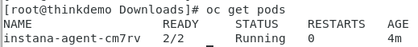
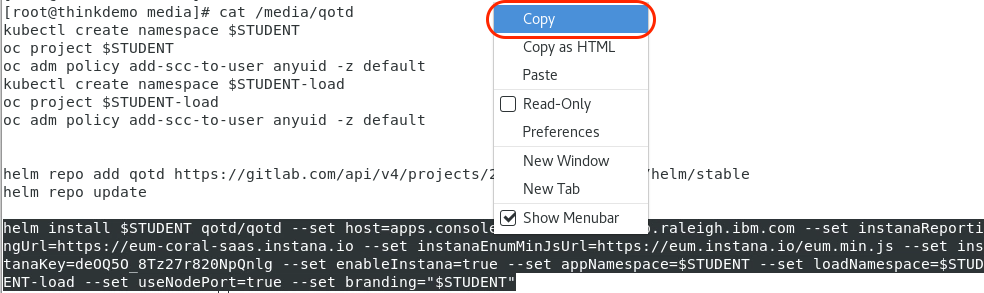
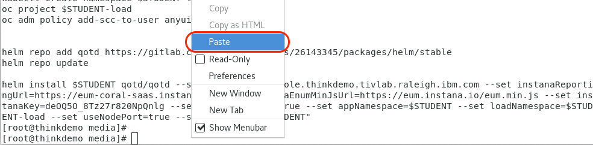
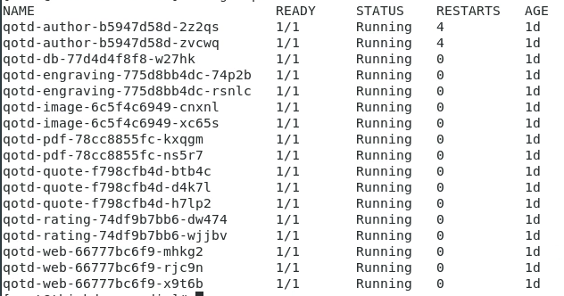
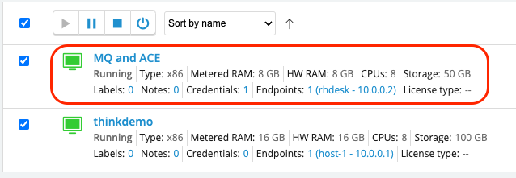
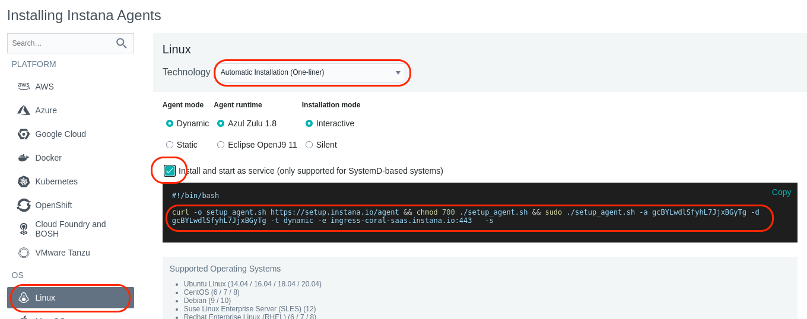
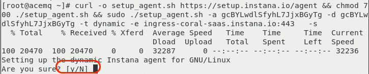
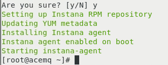
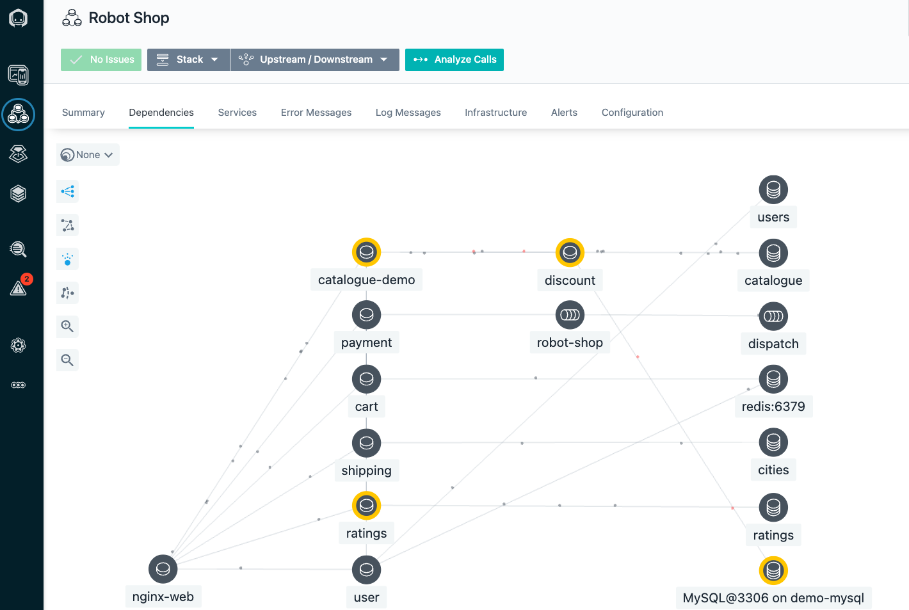

In this portion of the lab, you will be installing the Instana Monitoring, installing the "Quote of the Day" hybrid application, and configuring the Instana to monitor the application.

At this point, you should be logged into Soleil and should see the two virtual machines.


If you haven't already done it, click on the thinkdemo VM

Click on the window and you will see a login dialog.  Login as demo with a password of "**Passw0rd**"

After logging in, you will see that chrome has already been opened with 3 tabs at the top.  The first tab is the lab guide.  The 2nd tab is the Instana user interface,
and the 3rd tab is a list of user accounts.  From this point forward, we recommend you use the lab guide within the virtual machine.

Open the 3rd tab and review the user accounts.  You'll notice 3 columns.  The first column is the student name.  This matches the student name that you were assigned. 
Next to the Student Name, you will see an "Instana Login" column.  This column represents the username that you will use to login to the Instana user interface.  Find
the username associated with your "Student Name".  Finally, you will see a password column.
 

 Click on the 2nd tab in the browser to open the Instana user interface.  You'll see a login dialog.
   
 Enter the "Instana Login" name associated with **your student name** and enter the password that you found on the 3rd tab. Finally, click the Login button.

 You will see the summary page for Instana.  We'll come back to the user interface later.  

 For now, open a Terminal window within the virtual machine.  To do this, select "Applications" in the upper left corner.  Then, flyover "System Tools". Finally, select "Terminal"
 

 A terminal window will open.  Select the terminal window.


## Preparing to Install the Instana Agent
Next, we'll be installing the Instana Agent.  

To make things easier, we'll switch to the root user account using "sudo"


Type the follwing command:
```sh
sudo -i
```


When prompted, enter "**Passw0rd**" for the password.

Throughout these procedures, we are going to be using your student name for various naming conventions and to identify objects.  In order to simplify the steps in this document, 
you are going to setup an environment variable named $STUDENT and set it to the student name that you were assigned (student1 through student30) 

Type the following command, but replace **STUDENTXXX** with your student name.

The commend should look something like this:   **export STUDENT=student27**
```sh
export STUDENT=STUDENTXXX
```

Test to make sure the variable was set properly.  Type:
```sh
echo $STUDENT
```
The output should be something like "student27".


Throughout this lab, we will be using the "oc" command to run commands within OpenShift.  The "oc" command is similar to kubectl for other versions of kubernetes.  There are
some minor syntax differences.

Before installing the Instana Agent, we need to create a namespace (OpenShift Project) where the Agent will run.  Type the following command to create the namespace.
```sh
oc create namespace instana-agent
```

If successful, you'll see output similar to what's shown below.
  

 Next, change your context to the instana-agent namespace (OpenShift project) by typing "oc project instana-agent".  If you want to confirm that you have changed to the 
 instana-agent project, type:
 ```sh
 oc project
 ```

 Next, you need to setup the proper permissions for the Namespace/Project.  This will allow the Agent to have access to monitor the entire cluster.

 Type the following command:   
 ```sh
 oc adm policy add-scc-to-user privileged -z instana-agent
 ```

 You should see output similar to the screen capture below.
  

You are now ready to install the Agent.   


## Install the Instana Agent
Leave the Terminal window open, but select the browser and navigate to the tab containing the Instana user interface.   

Select the "Stan" the robot icon in the upper left corner
  

Next, click the "Deploy Agent" button near the upper right corner.
  

A window will open with a list of different environments where you can install the Instana Agent.  In this lab, we are installing into OpenShift, so select OpenShift from the list.
  

Select the dropdown list next to the word "Technology".  Notice that there are multiple options for installing the Agent.  Choose the "YAML" option from the list.
   

Enter a name for the Cluster and Zone as seen below.  Use **your student name** for the Cluster name and **your student name** for the Zone name.  This will allow you to find
your Agent and Kubernetes Cluster within the user interface and not get confused by data coming in from other students.
   

Next, click the "Download" button to download the yaml file.  The yaml file has been configured specifically to connect to your Instana SaaS environment.
   

You can now install the downloaded yaml file into the environment. This will install the Instana Agent as a daemonset within the OpenShift cluster.  The process is nearly
identical for other versions of kubernetes.

To install the Agent from the yaml file, type:  
```sh
oc create -f /home/demo/Downloads/configuration.yaml
```

You will see output similar to what's shown below
  

You will notice one error on the screen which simply indicates that it attemped to create the "instana-agent" project, but it already existed.  This error can be ignored.

Next, type:  
```sh
oc get pods
```

This will provide a list of the pods that are in this namespace (project).  Notice that the instana-agent pod is running.
  

If the pod is not running, wait a minute and issue the "oc get pods" command again.


## Preparing to Install the Quote of the Day Application
Next, you'll be installing the "Quote of the Day" application.   For the containerized portion of the application, a lot of the monitoring instrumentation.  In some cases, minor 
configuration changes are necessary.  You'll see that when we deploy the "Quote of the Day" application, we'll specify that we want to enable the Instana monitoring.

For more information about the Quote of the Day application, you can go to this GitLab location:  https://gitlab.com/quote-of-the-day/quote-of-the-day
It is not necessary to go to this GitLab location, but you might be interested in learning more about the application.

The first thing you need to do is to create namespaces (projects) for the application and the load generation tool to run.   Then, you need to setup the OpenShift permissions
for those projects.  Run the following commands to setup the namespaces and permissions.

Issue the following 6 commands:
```sh
oc create namespace $STUDENT-load
oc project $STUDENT-load
oc adm policy add-scc-to-user anyuid -z default
oc create namespace $STUDENT
oc project $STUDENT
oc adm policy add-scc-to-user anyuid -z default
```


**Perform the helm install of Quote of the Day**

The helm repository where we will be installing the application has already been setup on your virtual machine.  But, let's update the helm repo to ensure we get the current code.
Issue the following command:
```sh
helm repo update
```

You should see output indicating that it successfully got an update to the "qotd" chart repository.
  

Next, you need to define a Website within the Instana user interface.  Leave the terminal window open and return to the brower.  Open the browser tab containing the Instana UI.  Then, click on the Websites & Mobile Apps icon hear the upper left corner.
  

You will see a list of previously defined Websites.   You are going to create a new Website by clicking on the "+ Add Website" link near the upper right corner.
  

A dialog will open asking for a Website Name.  Enter your student name as the Website Name and click "Add Website" as seen below.
  

A dialog will open with some javascript.  For an existing web application, you could add this javascript to the HTML pages.  But, in this case, you will use it when you deploy the
Quote of the Day application.
  

As seen in the dialog, copy the value associated with the "key".  It is highlighted with a red oval.  Do not include the single quotes when you copy the text.  You'll use the key when performing the helm install of the application.  This will allow the application to send End User Experience (EUM) data to the Instana server.

The helm command that you are going to use is in a file /media/qotd.  You are going to use "sed" to replace the application key that is in that file with the key
that you just extracted from the Instana UI.   Type the following command.  When you type the command, replace **KEY_VALUE** with the key value that you extracted.

```sh
sed -i 's/deOQ5O_8Tz27r820NpQnlg/KEY_VALUE/g' /media/qotd
```

Again, we'll be using the $STUDENT environment variable to ensure that the command is unique for your student name.  Let's double check to make sure the variable 
is still set.  Type:
```sh
echo $STUDENT
```

If it is not set to your student name, type the following command and replace studentXXX with your student name.
```sh
export STUDENT=studentXXX
```

Next, you need to copy the helm command from the /media/qotd file.  Type the following command:
```sh
cat /media/qotd
```

Now, hightlight the command in the the terminal. Then, right click the mouse and select copy
  

Now, in the terminal window, right click with your mouse and select Paste.
  

If the command does not execute, press the ENTER key on your keyboard to run the helm install.

You should see output similar to what's shown below.
  

At this point, the application should be running.  In addition, the load generation tool is continuously running transactions against the application.  Let's verify that things are 
running.

Type:  oc get pods -n $STUDENT


You should see results similar to what's shown below.
  


If the pods are not running, wait a minute and try the "oc get pods" command again.

Next, verify that the automated workload is running.  Type the following command:
```sh
oc get pods -n $STUDENT-load
```

You should see results similar to what's shown below.
  

If the pods are not running, wait a minute and try the "oc get pods" command again.

**Configure Quote of the Day to use an external ACE and MQ**
The next step is to modify the configuration of the Quote of the Day application so that it uses an external ACE and MQ server.  By default it simulates the ACE/MQ workload.

You will do this by editing the deployment for the qotd-engraving.  In the command shown below, change studentXXX to your student name.

Type the following command:  
```sh
oc edit deployment qotd-engraving -n $STUDENT
```
Scroll down within the file to line 48.  You should see 3 lines of text like the following:
```sh
        - name: SUPPLY_CHAIN_URL
        - name: SUPPLY_CHAIN_SIMULATE
          value: "true"
```

You will modify those linkes to look like the following.  You need to add a "value" parameter that contains the SUPPLY_CHAIN_URL for the ACE flow.  Then, you'll need to change
the value for the SUPPLY_CHAIN_SIMULATE to "false" to disable the simulation.  When you are done, the lines should look like this:
```sh
        - name: SUPPLY_CHAIN_URL
          value: http://zoftig1.fyre.ibm.com:7081/supplychain/v1/order
        - name: SUPPLY_CHAIN_SIMULATE
          value: "false"
```


**Install and Configure the Instana Agent for ACE and MQ**

The next step is to go to the other virtual machine in Soleil.  Select the virtual machine named "MQ and ACE" to open the console.
  

At the login prompt, login with a password of "Passw0rd"

Within the Virtual Machines, select the "Instana" tab to open the Instana user interface.   Login using the username and password assigned to you.  If you don't remember,
the 3rd tab in the browser contains a list of user accounts.
  

Select the "Stan" the robot icon in the upper left corner
  

Next, click the "Deploy Agent" button near the upper right corner.
  

A window will open with a list of different environments where you can install the Instana Agent.  This is a Linux server, so select Linux on the left side of the screen.
  

Just to see what your options are, select the "Technology" dropdown list to see the different ways that you can install the Instana Agent.  You'll notice that you perform
rpm installs or simply download a tar file.  but, the easiest method is the default one, "Automatic Installation (One-Liner)".  Select that option in the dropdown list.

Notice that there are a few other options including the use of different java versions, static vs. dynamic agents, etc.   Leave those default settings.

Next, select the checkbox next to "Install and start as service".  This will setup the systemctl autostart process and will also start the Agent immediately after it is installed.

Finally, copy and paste the curl command by selecting in with your mouse and then doing a right-click and selecting "Copy".
  

Next, within the terminal window, right-click and select "Paste".  This will paste the install command into the terminal window.

Press "Enter" to begin the install.

You will be promted with "[Y/N]" asking whether you want to continue the install.   
  

Type "Y" and then press "Enter" to continue the install.

The install will progress and you will see an output similar to the screen capture shown below.
  

  At this point the Agent is installed and up and running.

The Agent will automatically start monitoring the operating system and start discovering key processes and middleware.  In many cases it will automatically instrument
those technologies.

In the case of MQ an and App Connect Enterprise(ACE), there are manual configuration steps required due to the need to provide credentials for accessing those applications.
We'll walk through those configuration steps next.


To continue other portions of the lab, select one of the lab exercises in the upper left corner or select one of the images below.


<Row>

<Column colLg={4} colMd={4} noGutterMdLeft>
<ArticleCard
    color="dark"
    subTitle="Explorer Instana"
    title="Explore the Instana UI and Capabilities"
    href="/tutorials/Explore"
    actionIcon="arrowRight"
    >



</ArticleCard>
</Column>

<Column colLg={4} colMd={4} noGutterMdLeft>
<ArticleCard
    color="dark"
    subTitle="Diagnose a Problem"
    title="Learn How Instana Can Help you Quickly Diagnose a Complex Problem"
    href="/tutorials/Diagnose"
    actionIcon="arrowRight"
    >


</ArticleCard>
</Column>

<Column colLg={4} colMd={4} noGutterMdLeft>
<ArticleCard
    color="dark"
    subTitle="Administer Instana"
    title="Learn How to Perform Administrative Tasks in Instana"
    href="/tutorials/Console_Access"
    actionIcon="arrowRight"
    >


</ArticleCard>
</Column>
</Row>


***