In this portion of the lab, you'll learn how to create and execute chargeback reports for virtual machines and containerized environments.  You'll also learn how to modify and assign a rate card that determines that cost of the services.
 

## Executing a chargeback report

1) Let's begin by executing an existing chargeback report.  Click the hamburger menu in the top right corner.
  

2) Then, select Manage costs -> Chargeback
  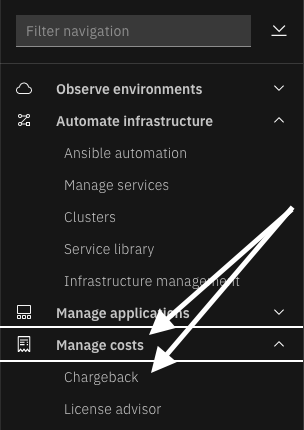

  You will see a page with one more more reports at the bottom of the page.
  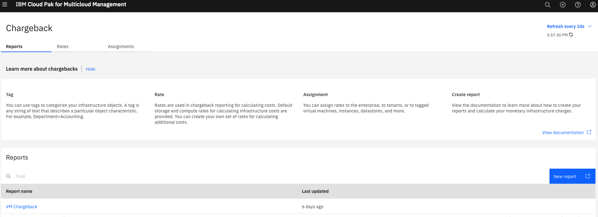

3) Let's begin by viewing the report. Click on the report titled "VM Chargeback".  You can either run the report by clicking on the Run report button.  Or, you can select one of the reports at the bottom of the page that have already been executed.  Given that it takes a little while to execute the report, we recommend that you select an existing report.   Select the most recently executed report.
  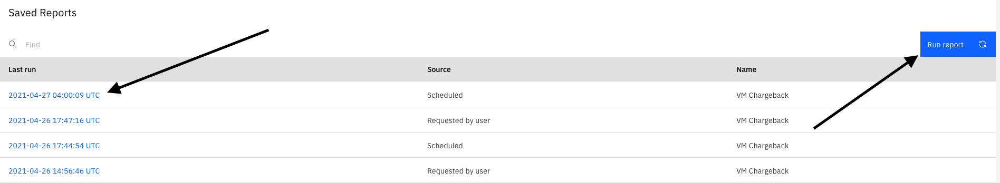

You'll see a report similar to the one shown below.  You can see the cost associated with each virtual machine and the department that is being charged for the VM.  If desired, you can click the blue button in the upper right corner labeled "Export Report" to export the report as either a text or CSV report.
  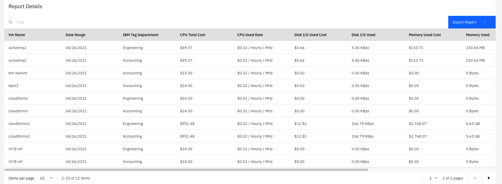

4) In the upper left corner click on "Reports" in the breadcrumb
  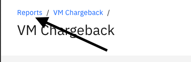

5) Now let's take a look at the Rate Card.  The Rate Card is what determines the charges for compute, memory, storage, and network.  Click on the "Rates" tab  at the top of the screen.
  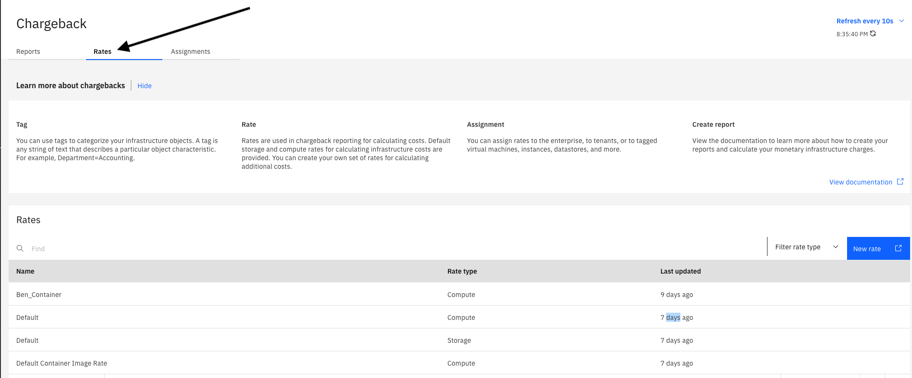

  You will see a few Rate cards listed at the bottom of the screen.  You will see that some of them have a Rate Type of Compute and some have a Rate Type of Storage.  Compute and Storage charges are tracked separately.  Later, we'll look at the details of the rate card and how to create one.

6) Next, click on the Assignments tab at the top of the screen.  The assignment identify which rate card will be used when running chargeback reports against specific types of resources (Compute, Storage, Containers), and specific groups of systems.  You'll notice that the "Default" "Compute" rate card is assigned to run against "Enterprise".  This means that when running Chargeback reports against Compute resources for the Enterprise, the "Default" rate card will be used.  It is possible to setup different rate cards for different groups of systems.  For example, use one rate card for VMware and a different rate card for public cloud resources.
  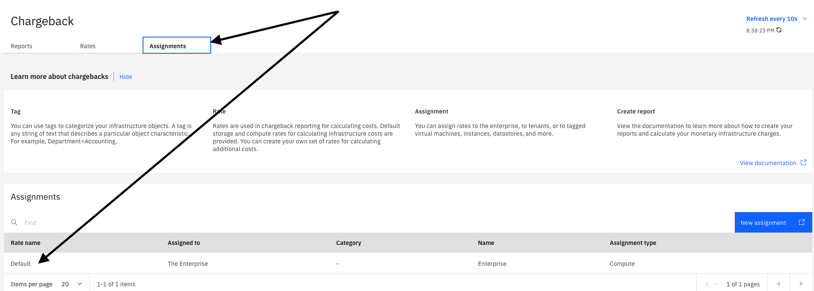

***

## Creating a Rate Card

Now, let's learn how to create a rate card.

1) First, click back on the "Rates" tab at the top of the screen.

2) Then, click on the "New Rate" button on the right side of the screen:  

3) This will open a new tab in your browser and take you into the Information Management user interface.  You'll notice that a new Chargeback rate card is already open and pre-populated with default values.
  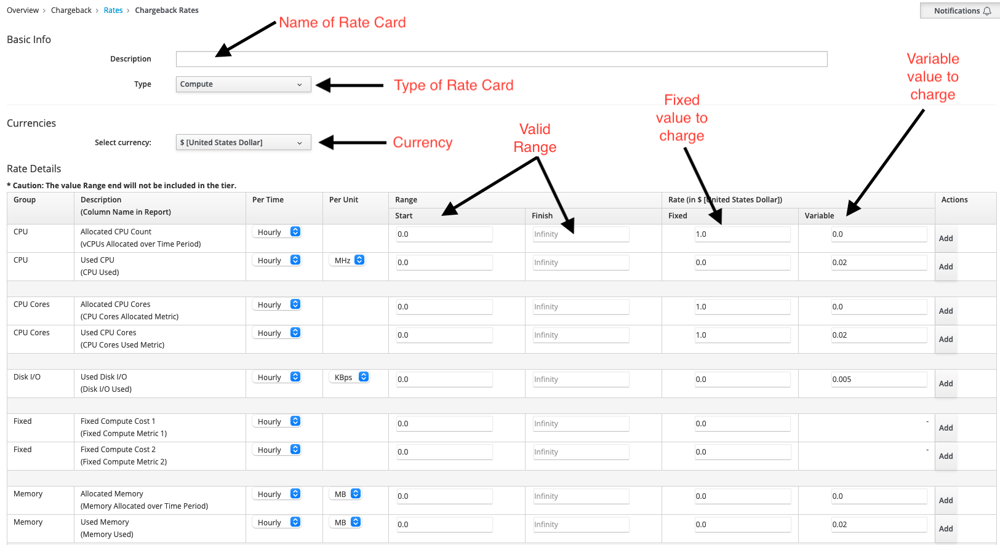

  On this panel, you'll notice a number of fields as described below:
  - Description:  This is the name of your rate card
  - Type:  This indicates whether this is a Compute or Storage rate card
  - Select currency:  You can choose any currency for your rate card. The default is US dollars
  - You'll see two fields that indicate the valid min/max range for a number of compute resources.  For example, the minimum amount of CPU is zero and there is no maximum value for the defaault values.
  - The last two columns represent the fixed value and variable amount to charge for specific aspects of Compute consumption.   For example, the default value is $1 per vCPU per hour.

  Let's fill in some of the values in the rate card.  Some are mandatory and some are optional.

4) First, assign a name to your rate card by filling in the Description field.  Use your username as part of the description so that you can find your rate card later.  In addition, use something in the description that allows you to know that this is a VM rate card rather than a container rate or storage rate card.
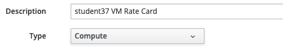

5) Leave the Type as Compute

6) If desired, change the currency to your own currency.

7) Try modifying a few of the values.  For example, In the first row, change the "Per Time" from Hourly to "Monthly" and change the Fixed cost to 500
  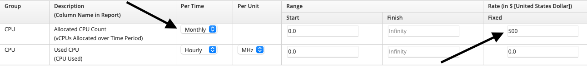

8) Change the Disk I/O form KBps to MBps and change the "Variable" cost accordingly.  Multiply the value by 1000 (value will be 5)
  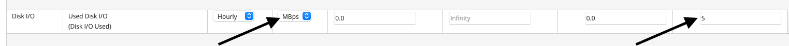

9) If desired, make some other changes to the rate card.

10) Then, click the "Add" button in the lower right corner to add your new rate card.   You should see a list of all of the rate cards including the one that you just created.
  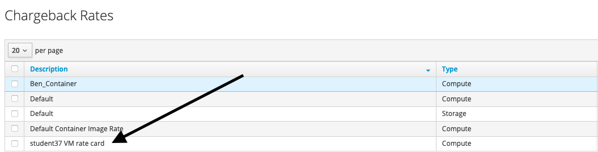

If you want, you can experiment with creating other types of rate cards.  For example, a Storage rate card.

***

## Creating a Chargeback Report

Next, let's create a Chargeback Report.  For this lab, we'll create a chargeback report for containerized workloads.  In a kubernetes environment, a typical application uses a specific namespace to host the application components.  So, we are going to create a report that is grouped by the Products (or namespaces).  

1) In the navigation on the left, click on Overview -> Reports.  Note: you might think that you should navigate to Overview -> Chargeback -> Reports, but you can only run reports from that menu item.
  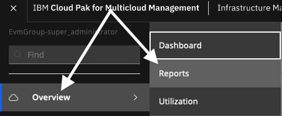

2) In most cases, when you navigate to Reports, you will be in the "Saved Reports" section.  Click and expand "Reports"
  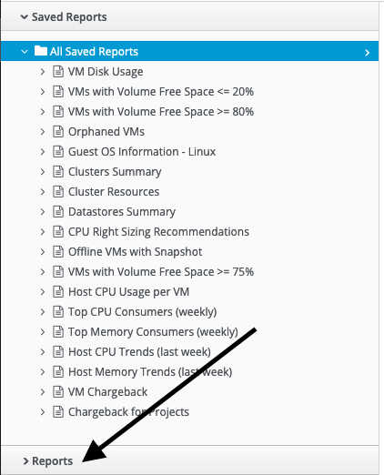

  You will see a list of out of the box report categories and reports such as Configuration Management for Virtual Machines, Trending, Optimization, and more. 

3) Scroll to the very bottom of the "Reports" section and you'll see a folder titled "Custom". The folders will be the color blue.
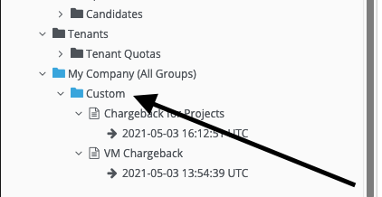

  This is the section where you will create all custom reports.  You can create your own custom reports, including chargeback reports.

4) Click to select the word "Custom".  Then, select "Configuration" -> "Add a new Report" at the top of the page.
  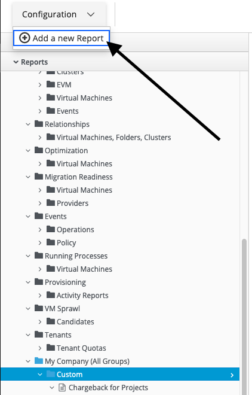

  A new blank report template will open.  

5) Begin filling in the details.  
  a) Give your report a Menu Name.  Use your username as part of the name so that you can find your report.  
  b) Enter a title for your report
  c) In the dropdown list for "Base the report on", choose "Chargeback for Projects".  In this context, a "Project" means that it is an OpenShift Project or Kubernetes Namespace.
    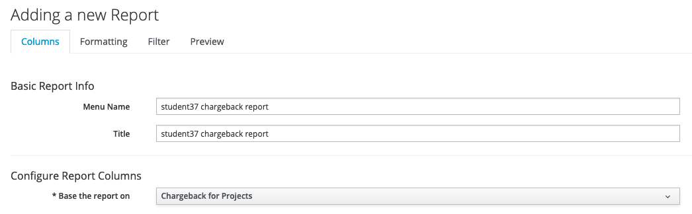

6) Now comes the only tricky part about creating reports.  In the dropdown labeled "Available Fields", select the fields shown below.  If you want to select a slighly different list, that's fine.  Also, know that you can select "Tags" that might exist in the data, such as Department or Location.
  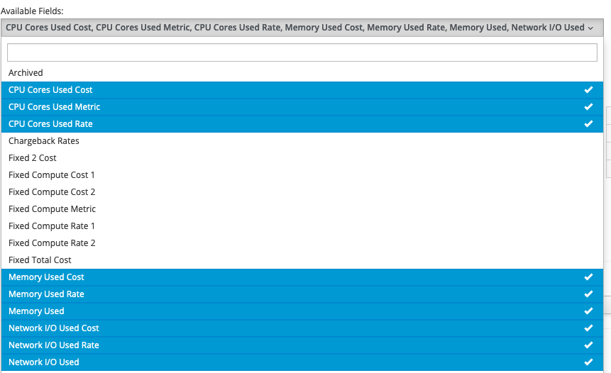

7) Now for the "tricky" step.  Do NOT click the "Add" button in the bottom right corner.   Instead, click to the right of the dropdown dialog box to collapse the list.  You will see that the metrics you selected will be listed in the "Available Fields" as seen below.   Then, click on the down arrow to move the fields down to the "Selected Fields".
  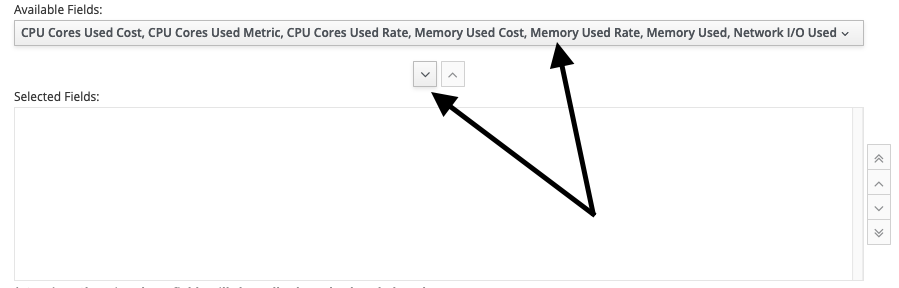

  After you have click on the down arrow, you'll see the fields listed in the "Selected Fields" box as seen below.
  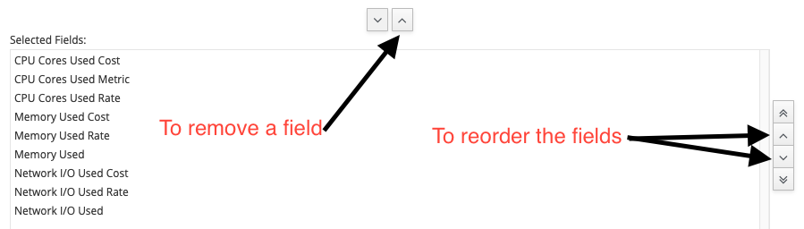

  The report will use the fields in the "Selected Fields" box and will show up in the order that you see them listed.

  You can use the up arrow to remove an unwanted fields.  Or, use the arrows on the right to reorder the fields.

  Before you save the report, you typically want to do some customization. 

8) First, click on the "Formatting" tab at the top of the screen.  You typically don't need to modify the formatting, but know that you can heavily customize the output data. For example, choose 0,1 or 2 decimal points, convert the data to exponential form, etc.
  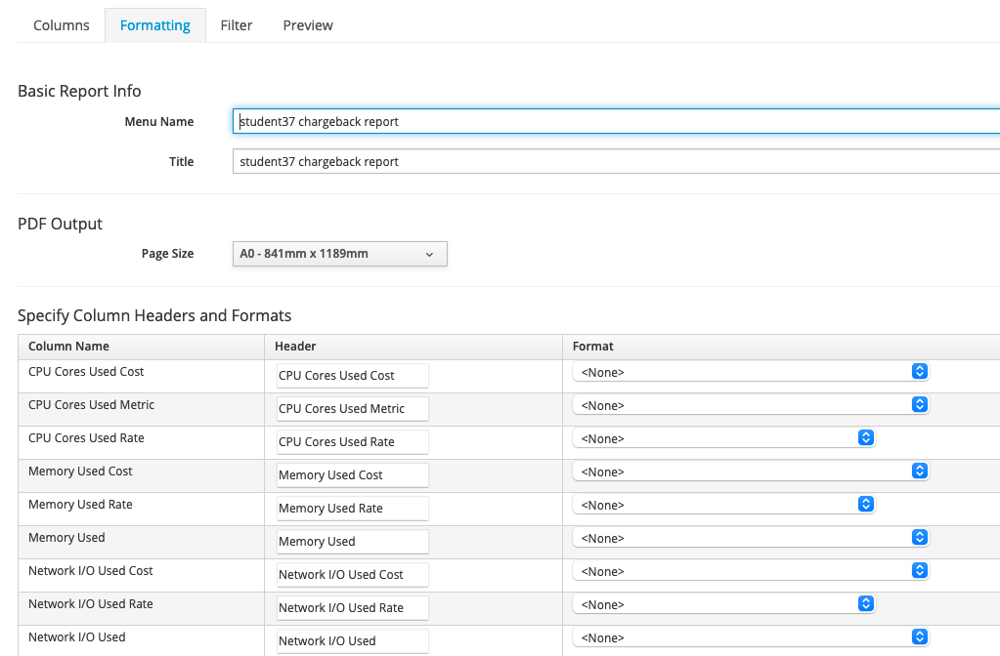

9) Next, click on the Filter tab at the top of the screen.
  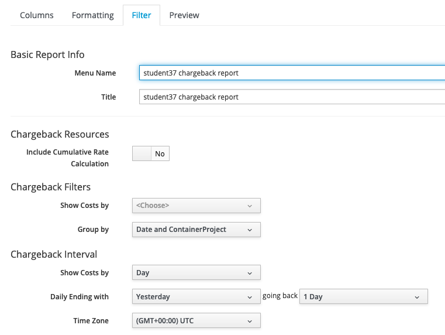

10) The filter tab allows you to do much more than just filtering.  It also allows you to specify the duration of the report and Grouping of the data.  Let's modify some of the default values.
  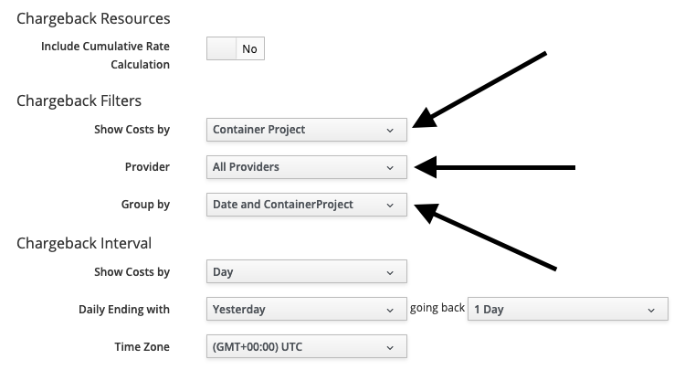

  As shown above, change the following values:
  - Show Costs by:   "Container Project"
  - Provider:  "All Providers"
  - Group by:  Data and ContainerProject"

11) This set of selections will create a report that shows the chargeback data for container projects.  It will include the data for "All" of the providers that exist in the environment.  In the context of containers, the Provider is the Kubernetes Cluster that you are monitoring.  Finally, you are going to Group the report by date and by the Kubernetes Namespace/Project.

12) The last step is to preview your report to make sure it is correct.  Click the Preview tab.   Then, click on the "Generate Report Preview" icon to preview the report.
  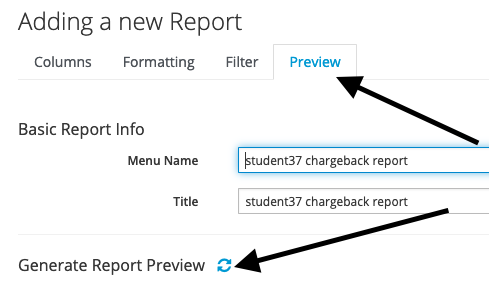

13) You will see a report that looks something like this:
  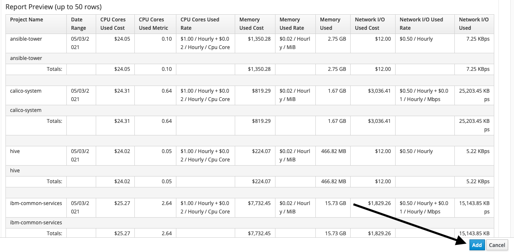

14) Assuming the report looks correct, click "Add" in the bottom right corner to save your report.

15) Now, you can run your report.  Find your report in the "Custom" section of the Reports list.  Select your report.  Then, click the "Queue" icon at the top of the screen.  This will queue your report for execution.  

16) After you click "Queue", you will see your report in the middle of the page with a status of either "Queued" or "Running".  On the left size, you'll see "Generating Report" just below your report name.  After a period of time, the report will generate.  In order to see the status update, it is necessary to refresh the page or click away and click back.

17) Once the report has been generated, you will see the text "Generating Report" replaced by the data and time that the report was generated.
  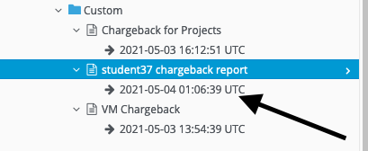

18) Click on the data and time to view the report.

19) If desired, you can also schedule your report to run at regular intervals.  To schedule a report, select your report in the Custom folder.  Then, select "Configuration" -> "Add a new Schedule" at the top of the screen.
  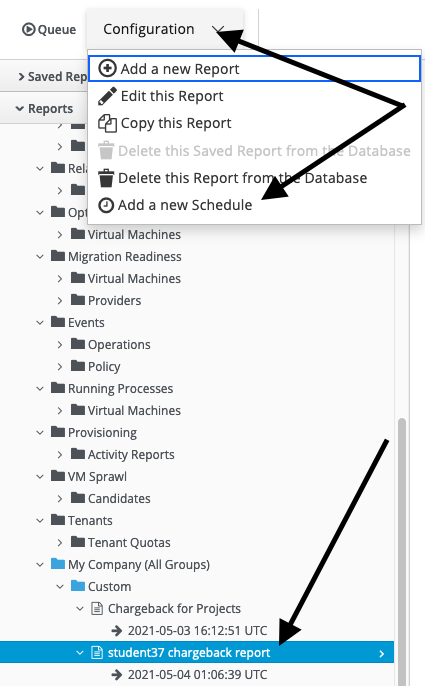

20) The scheduling of reports is pretty straightforward.  For example, select Run "Weekly" every "Week.  Select a starting time such at 5:00 UTC.  Optionally, select to send an e-mail when the report is generated.
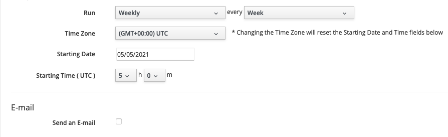

This concludes the section of the report on Chargeback. In this section, you've learned how to create reports, view reports generated by other people, assign rate cards, schedule reports, and more.  

To continue other portions of the lab, select one of the lab exercises in the upper left corner or select one of the images below.

<Row>

<Column colLg={3} colMd={3} noGutterMdLeft>
<ArticleCard
    color="dark"
    subTitle="Automation with VMware"
    title="Want to learn how to automate infrastructure management in VMWare vSphere?"
    href="/tutorials/vmware"
    actionIcon="arrowRight"
    >

</ArticleCard>

</Column>

<Column colLg={3} colMd={3} noGutterMdLeft>
<ArticleCard
    color="dark"
    subTitle="Automation with the Public Cloud"
    title="Want to learn how to automate infrastructure management in Public clouds?"
    href="/tutorials/ibmcloud"
    actionIcon="arrowRight"
    >

</ArticleCard>
</Column>

<Column colLg={3} colMd={3} noGutterMdLeft>
<ArticleCard
    color="dark"
    subTitle="Managing SRE console access"
    title="Do you want to learn how to provide SRE secure terminal access to Virtual Machines?"
    href="/tutorials/Console_Access"
    actionIcon="arrowRight"
    >

</ArticleCard>
</Column>

</Row>

***