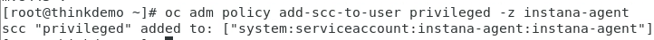
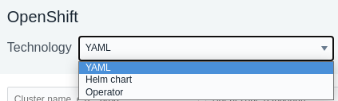

In this portion of the lab, you will be installing the Instana Monitoring, installing the "Quote of the Day" hybrid application, and configuring the Instana to monitor the application.

At this point, you should be logged into Soleil and should see the two virtual machines.

If you haven't already done it, click on the thinkdemo VM

Click on the window and you will see a login dialog.  Login as demo with a password of "Passw0rd"

After logging in, you will see that chrome has already been opened with 3 tabs at the top.  The first tab is the lab guide.  The 2nd tab is the Instana user interface,
and the 3rd tab is a list of user accounts.  From this point forward, we recommend you use the lab guide within the virtual machine.

Open the 3rd tab and review the user accounts.  You'll notice 3 columns.  The first column is the student name.  This matches the student name that you were assigned. 
Next to the Student Name, you will see an "Instana Login" column.  This column represents the username that you will use to login to the Instana user interface.  Find
the username associated with your "Student Name".  Finally, you will see a password column.
 

 Click on the 2nd tab in the browser to open the Instana user interface.  You'll see a login dialog.
   
 Enter the "Instana Loging" name associated with your student name and enter the password that you found on the 3rd tab. Finally, click the Login button.

 You will see the summary page for Instana.  We'll come back to the user interface later.  

 For now, open a Terminal window within the virtual machine.  To do this, select "Applications" in the upper left corner.  Then, flyover "System Tools". Finally, select "Terminal"
 

 A terminal window will open.  Select the terminal windows.
 

## Preparing to Install the Instana Agent
Next, we'll be installing the Instana Agent.  

To make things easier, we'll switch to the root user account type typing "sudo -i"
Type:  sudo -i  

When prompted, enter "Passw0rd" for the password.

Throughout this lab, we will be using the "oc" command to run commands within OpenShift.  The "oc" command is similar to kubectl for other versions of kubernetes.  There are
some minor syntax differences.

Before installing the Instana Agent, we need to create a namespace (OpenShift Project) where the Agent will run.  Type "oc create namespace instana-agent" to create
the namespace.
 

 Next, change your context to the instana-agent namespace (OpenShift project) by typing "oc project instana-agent".  If you want to confirm that you have changed to the 
 instana-agent project, type "oc project".

 Next, you need to setup the proper permissions for the Namespace/Project.  This will allow the Agent to have access to monitor the entire cluster.
 Type the following command:   oc adm policy add-scc-to-user privileged -z instana-agent
 You should see output similar to the screen capture below.
  

You are now ready to install the Agent.   

## Install the Instana Agent
Leave the Terminal window open, but select the browser and navigate to the tab containing the Instana user interface.   

Select the "Stan" the robot icon in the upper left corner
  

Next, click the "Deploy Agent" button near the upper right corner.
  

A window will open with a list of different environments where you can install the Instana Agent.  In this lab, we are installing into OpenShift, so select OpenShift from the list.
  

Select the dropdown list next to the word "Technology".  Notice that there are multiple options for installing the Agent.  Choose the "YAML" option from the list.
   

Enter a name for the Cluster and Zone as seen below.  Use your student name for the Cluster name and your student name for the Zone name.  This will allow you to find
your Agent and Kubernetes Cluster within the user interface and not get confused by data coming in from other students.
   

Next, click the "Download" button to download the yaml file.  The yaml file has been configured specifically to connect to your Instana SaaS environment.
   

You can now install the downloaded yaml file into the environment. This will install the Instana Agent as a daemonset within the OpenShift cluster.  The process is nearly
identical for other versions of kubernetes.

To install the Agent from the yaml file, type:  oc create -f /home/demo/Downloads/configuration.yaml
  

You will notice one error on the screen which simply indicates that it attemped to create the "instana-agent" project, but it already existed.  This error can be ignored.

Next, type:  oc get pods
This will provide a list of the pods that are in this namespace (project).  Notice that the instana-agent pod is running.
  

If the pod is not running, wait a minute and issue the "oc get pods" command again.

Once the pod is running, let's navigate to the Instana user interface.   Leave the terminal window open because you will be using it later.

This concludes the section of the report on Chargeback. In this section, you've learned how to create reports, view reports generated by other people, assign rate cards, schedule reports, and more.  

To continue other portions of the lab, select one of the lab exercises in the upper left corner or select one of the images below.

<Row>

<Column colLg={3} colMd={3} noGutterMdLeft>
<ArticleCard
    color="dark"
    subTitle="Automation with VMware"
    title="Want to learn how to automate infrastructure management in VMWare vSphere?"
    href="/tutorials/vmware"
    actionIcon="arrowRight"
    >

</ArticleCard>

</Column>

<Column colLg={3} colMd={3} noGutterMdLeft>
<ArticleCard
    color="dark"
    subTitle="Automation with the Public Cloud"
    title="Want to learn how to automate infrastructure management in Public clouds?"
    href="/tutorials/ibmcloud"
    actionIcon="arrowRight"
    >

</ArticleCard>
</Column>

<Column colLg={3} colMd={3} noGutterMdLeft>
<ArticleCard
    color="dark"
    subTitle="Managing SRE console access"
    title="Do you want to learn how to provide SRE secure terminal access to Virtual Machines?"
    href="/tutorials/Console_Access"
    actionIcon="arrowRight"
    >

</ArticleCard>
</Column>

</Row>

***