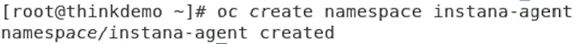
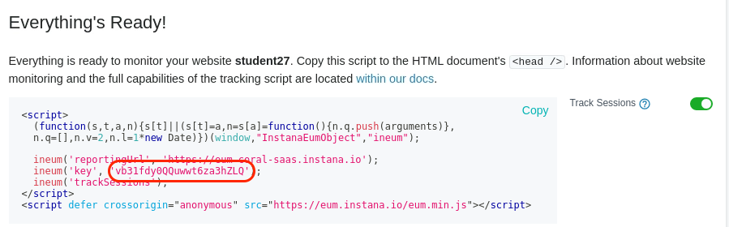

In this portion of the lab, you will be installing the Instana Monitoring, installing the "Quote of the Day" hybrid application, and configuring the Instana to monitor the application.

At this point, you should be logged into Soleil and should see the two virtual machines.

If you haven't already done it, click on the thinkdemo VM

Click on the window and you will see a login dialog.  Login as demo with a password of "Passw0rd"

After logging in, you will see that chrome has already been opened with 3 tabs at the top.  The first tab is the lab guide.  The 2nd tab is the Instana user interface,
and the 3rd tab is a list of user accounts.  From this point forward, we recommend you use the lab guide within the virtual machine.

Open the 3rd tab and review the user accounts.  You'll notice 3 columns.  The first column is the student name.  This matches the student name that you were assigned. 
Next to the Student Name, you will see an "Instana Login" column.  This column represents the username that you will use to login to the Instana user interface.  Find
the username associated with your "Student Name".  Finally, you will see a password column.
 

 Click on the 2nd tab in the browser to open the Instana user interface.  You'll see a login dialog.
   
 Enter the "Instana Login" name associated with your student name and enter the password that you found on the 3rd tab. Finally, click the Login button.

 You will see the summary page for Instana.  We'll come back to the user interface later.  

 For now, open a Terminal window within the virtual machine.  To do this, select "Applications" in the upper left corner.  Then, flyover "System Tools". Finally, select "Terminal"
 

 A terminal window will open.  Select the terminal windows.
 

## Preparing to Install the Instana Agent
Next, we'll be installing the Instana Agent.  

To make things easier, we'll switch to the root user account type typing "sudo -i"
Type:  sudo -i  

When prompted, enter "Passw0rd" for the password.

Throughout this lab, we will be using the "oc" command to run commands within OpenShift.  The "oc" command is similar to kubectl for other versions of kubernetes.  There are
some minor syntax differences.

Before installing the Instana Agent, we need to create a namespace (OpenShift Project) where the Agent will run.  Type "oc create namespace instana-agent" to create
the namespace.
 

 Next, change your context to the instana-agent namespace (OpenShift project) by typing "oc project instana-agent".  If you want to confirm that you have changed to the 
 instana-agent project, type "oc project".

 Next, you need to setup the proper permissions for the Namespace/Project.  This will allow the Agent to have access to monitor the entire cluster.
 Type the following command:   oc adm policy add-scc-to-user privileged -z instana-agent
 You should see output similar to the screen capture below.
  

You are now ready to install the Agent.   

## Install the Instana Agent
Leave the Terminal window open, but select the browser and navigate to the tab containing the Instana user interface.   

Select the "Stan" the robot icon in the upper left corner
  

Next, click the "Deploy Agent" button near the upper right corner.
  

A window will open with a list of different environments where you can install the Instana Agent.  In this lab, we are installing into OpenShift, so select OpenShift from the list.
  

Select the dropdown list next to the word "Technology".  Notice that there are multiple options for installing the Agent.  Choose the "YAML" option from the list.
   

Enter a name for the Cluster and Zone as seen below.  Use your student name for the Cluster name and your student name for the Zone name.  This will allow you to find
your Agent and Kubernetes Cluster within the user interface and not get confused by data coming in from other students.
   

Next, click the "Download" button to download the yaml file.  The yaml file has been configured specifically to connect to your Instana SaaS environment.
   

You can now install the downloaded yaml file into the environment. This will install the Instana Agent as a daemonset within the OpenShift cluster.  The process is nearly
identical for other versions of kubernetes.

To install the Agent from the yaml file, type:  oc create -f /home/demo/Downloads/configuration.yaml
  

You will notice one error on the screen which simply indicates that it attemped to create the "instana-agent" project, but it already existed.  This error can be ignored.

Next, type:  oc get pods
This will provide a list of the pods that are in this namespace (project).  Notice that the instana-agent pod is running.
  

If the pod is not running, wait a minute and issue the "oc get pods" command again.

Once the pod is running, let's navigate to the Instana user interface.   Leave the terminal window open because you will be using it later.

## Install the Quote of the Day Application
Next, you'll be installing the "Quote of the Day" application.   For the containerized portion of the application, a lot of the monitoring instrumentation.  In some cases, minor 
configuration changes are necessary.  You'll see that when we deploy the "Quote of the Day" application, we'll specify that we want to enable the Instana monitoring.

For more information about the Quote of the Day application, you can go to this GitLab location:  https://gitlab.com/quote-of-the-day/quote-of-the-day
It is not necessary to go to this GitLab location, but you might be interested in learning more about the application.

The first thing you need to do is to create namespaces (projects) for the application and the load generation tool to run.   Then, you need to setup the OpenShift permissions
for those projects.  Run the following commands.   When you run the commands, specify your student name instead of student***. 

For example, if your student name is student27, issue the following command:   oc create namespace student27

Issue the following 6 commands, replacing student*** with your student name:
oc create namespace student *** -load
oc project student***-load
oc adm policy add-scc-to-user anyuid -z default
oc create namespace student***
oc project student***
oc adm policy add-scc-to-user anyuid -z default

The helm repository where we will be installing the application has already been setup on your virtual machine.  But, let's update the helm repo to ensure we get the current code.
Issue the following command:

helm repo update

You should see output indicating that it successfully got an update to the "qotd" chart repository.
  

Next, you need to define a Website within the Instana user interface.  Open the browser tab with the Instana UI.  Then, click on the Websites & Mobile Apps icon hear the upper left corner.
  

You will see a list of previously defined Websites.   You are going to create a new Website by clicking on the "+ Add Website" link near the upper right corner.
  

A dialog will open asking for a Website Name.  Enter your student name as the Website Name as seen below.
  

A dialog will open with some javascript.  For an existing web application, you could add this javascript to the HTML pages.  But, in this case, we will use it when we deploy The
Quote of the Day application.
  

As seen in the dialog, copy the value associated with the "key".  Do not include the single quotes when you copy the text.  You'll use the key when performing the helm install of the 
application.  This will allow the application to send End User Experience (EUM) data to the Instana server.

You will be issuing a helm install command to install the application.  Before you do the install, you need to make sure the helm command matches your environment.  You previously 
create two namespace(projects) using your student name.  We'll be using those names in the command.

Edit the following file using vi or the Linux Test Editor that can be found under the Applications->Accessories menu.  Edit /media/qotd
Once the file is open, go to the bottom of the screen where you'll see the following command:

helm install student6 qotd/qotd --set host=apps.console.thinkdemo.tivlab.raleigh.ibm.com --set instanaReportingUrl=https://eum-coral-saas.instana.io --set instanaEnumMinJsUrl=https://eum.instana.io/eum.min.js --set instanaKey=aOY24DI5TziFBCfXFQEHuQ --set enableInstana=true --set appNamespace=student6 --set loadNamespace=student6-load --set useNodePort=true --set branding="student6"

You need to change 2 things within this helm command.   
1) Replace student6 with your student name. 
2) Rplace the instanaKey with the key for the website that you created earlier within the Instana UI.   

Now that you have edited the /media/qotd file, save your changes.

Next, select the helm install command.  Then, right click and select "Copy"
  

Now, open the terminal window.  Within the terminal window, right click and select "Paste" to paste the helm command into the terminal window.
  

Press the "Enter" key to run the helm install.  You should see output similar to what's shown below.
  

This concludes the section of the report on Chargeback. In this section, you've learned how to create reports, view reports generated by other people, assign rate cards, schedule reports, and more.  

To continue other portions of the lab, select one of the lab exercises in the upper left corner or select one of the images below.

<Row>

<Column colLg={3} colMd={3} noGutterMdLeft>
<ArticleCard
    color="dark"
    subTitle="Automation with VMware"
    title="Want to learn how to automate infrastructure management in VMWare vSphere?"
    href="/tutorials/vmware"
    actionIcon="arrowRight"
    >

</ArticleCard>

</Column>

<Column colLg={3} colMd={3} noGutterMdLeft>
<ArticleCard
    color="dark"
    subTitle="Automation with the Public Cloud"
    title="Want to learn how to automate infrastructure management in Public clouds?"
    href="/tutorials/ibmcloud"
    actionIcon="arrowRight"
    >

</ArticleCard>
</Column>

<Column colLg={3} colMd={3} noGutterMdLeft>
<ArticleCard
    color="dark"
    subTitle="Managing SRE console access"
    title="Do you want to learn how to provide SRE secure terminal access to Virtual Machines?"
    href="/tutorials/Console_Access"
    actionIcon="arrowRight"
    >

</ArticleCard>
</Column>

</Row>

***