<FeatureCard
  title="Automating management of applications in public clouds"
  color="dark"
  >


</FeatureCard>


<AnchorLinks>
  <AnchorLink>Lab Overview</AnchorLink>
  <AnchorLink>Managing infrastructure in public clouds</AnchorLink>
  <AnchorLink>Exploring the cloud providers</AnchorLink>
  <AnchorLink>Exploring the cloud providers</AnchorLink>  
  <AnchorLink>Summary</AnchorLink>
</AnchorLinks>

***

## Lab Overview

IBM Cloud Pak for Watson AIOps Infrastructure Management delivers the insight, control, and automation enterprises need to address challenges of managing hybrid cloud environments, which are far more complex than traditional data center. This technology enables enterprises with existing virtual infrastructures to improve visibility and control, and those just starting virtualization deployments to build and operate a well-managed virtual infrastructure.

IBM Cloud Pak for Watson AIOps Infrastructure Management includes the following feature sets:

- Insight: discovery, monitoring, utilization, performance, reporting, analytics, chargeback, and trending.
- Control: security, compliance, alerting, policy-based resource and configuration management.
- Automate: IT process, task, and event, provisioning, workload management and orchestration.
- Integrate: systems management, tools and processes, event consoles, CMDB, RBA, and web services.

In this tutorial, you will explore the following key capabilities:

- Understand Cloud Pak for Watson AIOps Infrastructure Management capabilities for public clouds
- Learn how to deploy a new service in a public cloud
- Learn how to manage lifecycle of the service
- Learn how to apply configuration and control policies to the managed VMs
- Learn how Cloud Pak help SRE teams managing infrastructure in public clouds with full audit trail.

***

## Managing infrastructure in public clouds

  There are multiple technologies available to provision and manage IT services and infrastructure in public clouds. Each of them has some advantages and there is no way one can fully replace the others. This creates a real challenge for enterprises: "How to achieve consistency and traceability across all environments?". IBM Cloud Pak for Watson AIOps - Infrastructure Management helps integrate different tools and technologies in the closed-loop management cycle.

  In the following exercise, you learn how to provision a new service in a public cloud using Terraform. You will extend the service (which initially provisions set of 2 virtual machines) with the configuration management task driven by Ansible. Then, you will explore how tags are mapped to provide a consistent view of the resources across all infrastructure providers and how to apply the configuration policies to ensure configuration governance.

### Exploring the cloud providers

  Log in to the Cloud Pak user interface with your assigned user id (studentX). From the "hamburger" menu in the top-left corner select **Automate infrastructure -> Infrastructure management**

  

  New browser tab opens with Infrastructure management user interface. Here, depending on the assigned permissions you can view and manage virtual machines in any of the connected environements. Let's explore infrastructure in public clouds. From the left-hand side menu select **Compute -> Providers**

  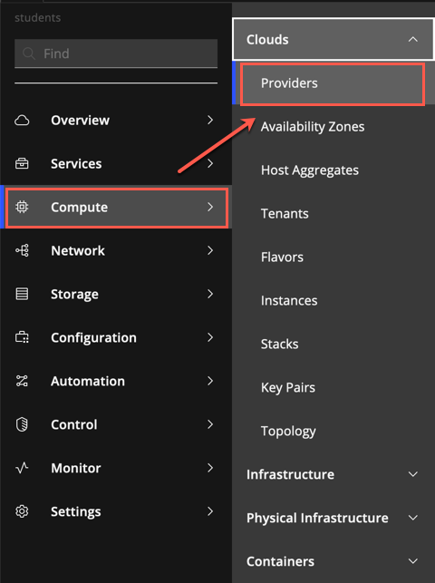

  You should see some public cloud regions from different public providers registered. Due to the fact that this is a shared environment you cannot edit the providers, but you should know that IBM Cloud Pak for Watson AIOps Infrastructure Management currently supports the following clouds:

  - Amazon EC2
  - Google Cloud Engine
  - IBM Cloud
  - Microsoft Azure
  - Microsoft Azure Stack
  - Openstack
  - VMware vCloud

  

  Additional providers are planned for second half of 2021

  Click any of the available providers (for example us-east-ohio). You will see details of all resources provisioned in selected region (to which you have access rights assigned). To explore further, click the **Instances**.

  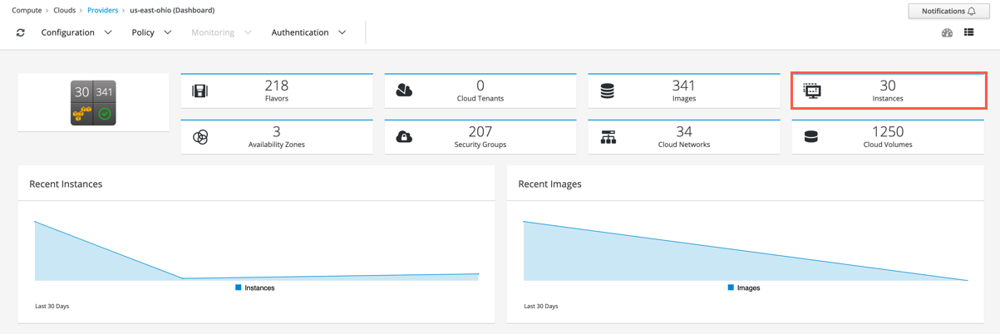

  If you cannot see any instances on the list, it means that your access rights are limited. Let's provision some new instances.

### Exploring the service library

  Go back to the main browser tab **IBM Cloud Pak for ...**. This time from the "hamburger" menu select **Automate infrastructure -> Manage services**.

  In case you access this module for the first time, "Welcome" screen may pop-up. If that happens, click the **Service library** link.

  

  In the Service Library view you can see all services defined in the Cloud Pak. On the left you can see different service categories (1), on the right list of all services in a selected category (2). On top, there are additional tabs, where you can define the terraform templates for your environment. 

  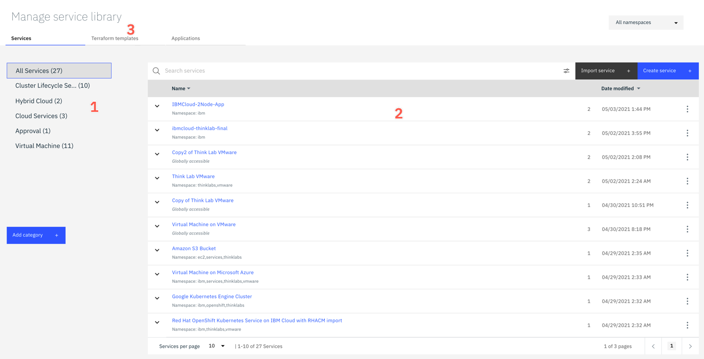

  Unfold versions of the **IBMCloud-2Node-App** service (1), then click  **three dots** icon on the right in the **(default)** row (2), and select **View** (3).

  

  This view shows all the details of the service. Click the **Composition** tab to see the provisioning flow.

  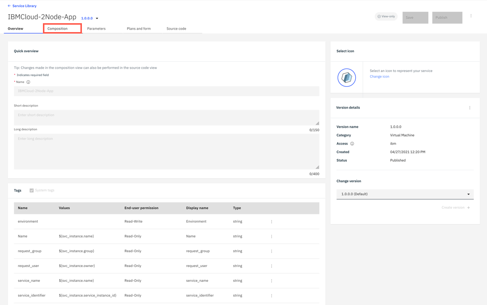

  You can see that service flow includes two tasks:
  - a terraform template **ibmcloud-vpc-thinklab**, and
  - Ansible inventory task

  

  First task provisions a terraform template in IBM Cloud. When it completes, the second one registers newly provisioned VMs in Ansible inventory so you can run the configfuration tasks against them. Let's add some Ansible task to the flow. Since the service is already published, to modify it you have to first create a new version. Go back to the **Service Library** view.

  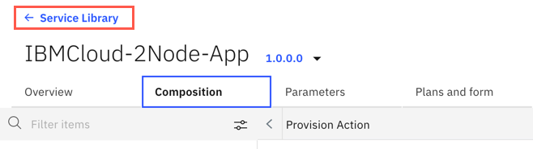

  In the row **IBMCloud-2Node-App** click the **3 dots** icon on the right, and select **Add version**.

  

  Provide unique version name (1) - for example provide your student id number as a last field. Notice, that the version number must be in a format X.Y.Z.V. Finally, click **Add** (2).

  

  New version of the service is opened in Service editor. Go to the **Composition** tab (1), unfold the available ansible tasks on the left (2) and drag-and-drop **Configure Nginx** task next to the Ansible inventory task in the flow (3).

  

  Click a newly added task to edit parameters.

  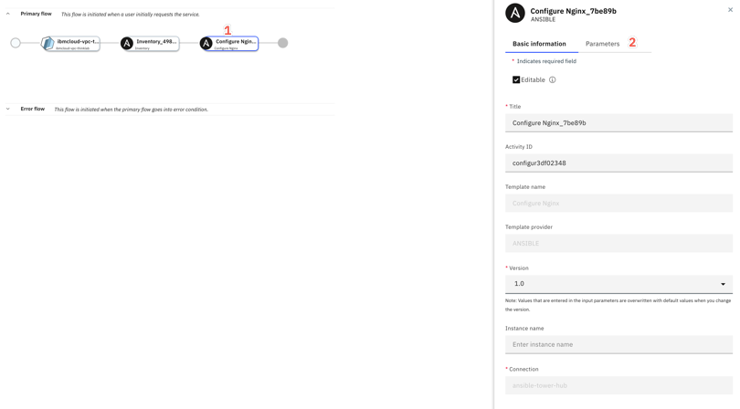

  There are three parameters available:

  - inventory name
  - credentials
  - extra variables (to be passed to Ansible playbook)

  Click **inventory_name** link (1) and then click **Link parameter** (2).

  

  Instead of providing the static value, you will link as input the output value from the previous **Ansible inventory** task. Pick **Ansible** (1) and unfold the **Inventory** task parameters (2).

  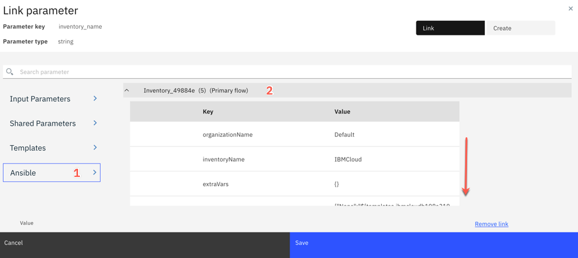

  Scroll down and select **inventory_name (output)** (1). To create a linkage click the '+' sign next to the parameter name. Then, click **Save** (2).

  

  As a second required parameter **credential_name** provide the static value "default-ssh-key" and click **Save**. In our lab setup, each virtual machine is provisioned with SSH key embedded in a template, and Ansible Tower that is used for automating the configuration tasks, has a matching private key stored with this name. Alternatively, you could add **Ansible Credentials** task in the flow to create a credentials dynamically, but we wanted to simplify the flow for the time sake.

  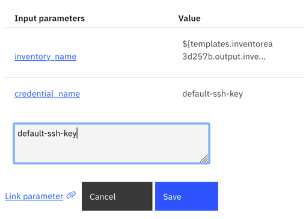

  When both parameters are in place, click the **Save** button on the top. Then, click "three dots" icon next to Publish button and select **Test deploy**.

  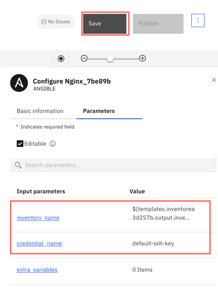 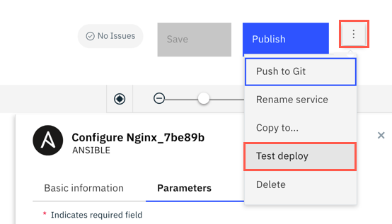

  Provisioning dialog opens. Click **Next**

  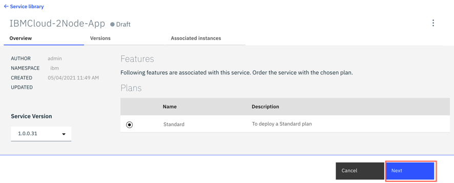

  Provide the required parameters. For **service name** (1) and **prefix** (2) provide a unique name (for example your user id). For ssh key (3) you have to provide a personal public ssh key. Since all the students are using the workstation generated from the same template let's generate a new one. Open the Terminal windows and run the following command

  ```sh
  ssh-keygen -t rsa -f student
  ```

  Sample output should look like below:

  ```sh
  ssh-keygen -t rsa -f student
  Generating public/private rsa key pair.
  Enter passphrase (empty for no passphrase): 
  Enter same passphrase again: 
  Your identification has been saved in student.
  Your public key has been saved in student.pub.
  The key fingerprint is:
  SHA256:ttvYM7oiJjgOFW+wuRhUYU/OGQdMlEilArmV12zsMS8 dymaczew@Wlodeks-MBP
  The key's randomart image is:
  +---[RSA 3072]----+
  |...*B@o.         |
  |o =.Bo@          |
  | =oo B +         |
  |o .*  E .        |
  |. + o  .S        |
  | + o   . .       |
  |o..     .        |
  |+ . o .  =o      |
  |.o o . .=ooo     |
  +----[SHA256]-----+
  ```

  List the content of **student.pub** file (cat student.pub) and copy the key to the provisioning dialog. You can change **Environment** type (4) - that will be dynamically mapped to the filters in the Infrastructure management UI. Finally hit **Deploy** button (5).

  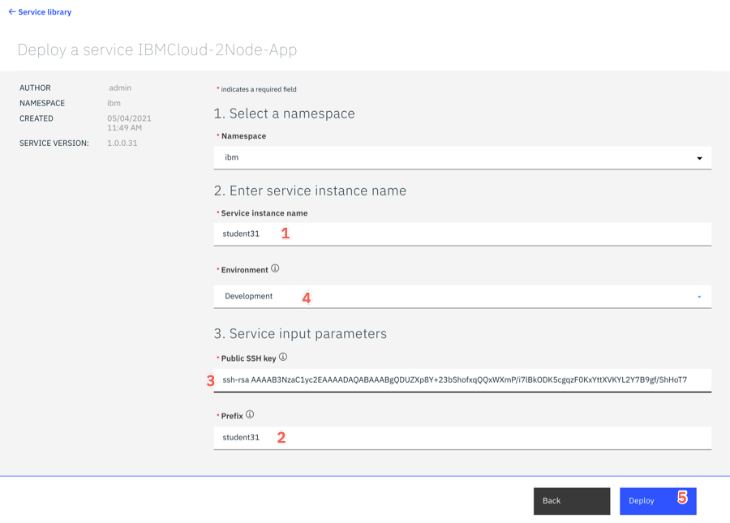

  On the Order confirmation dialog select **Go to instances** to verify the provisioning process.

  

  Click the row with your service instance.

  

  You should see your tasks progressing. You can click **Log file** tab to see the detailed log from each activity.

  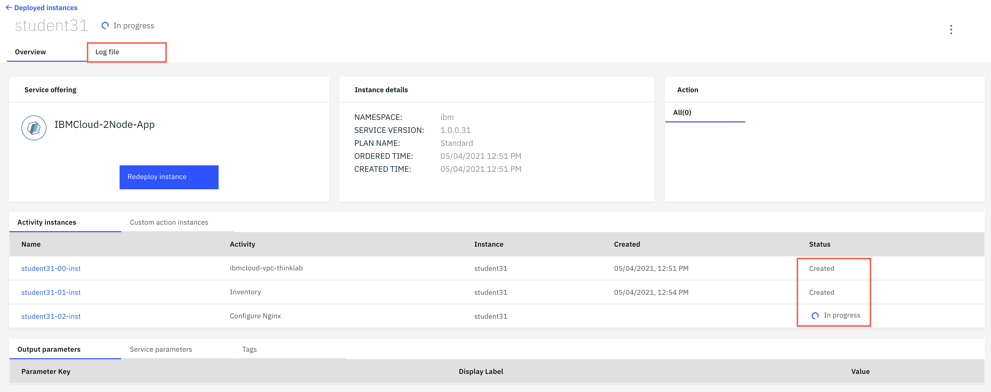

  If everything works as expected, at the end of terraform provisioning log you should see the public IP of newly provisioned service.

  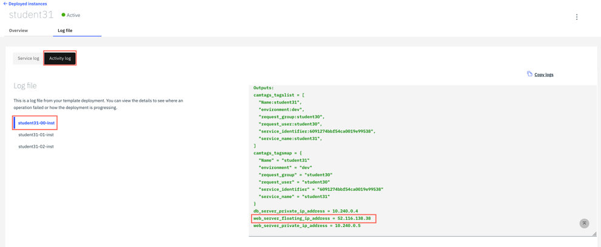

  If the service is **Active** (with green dot next to it), you can point a new browser tab to see if you can connect to your new service instance.

  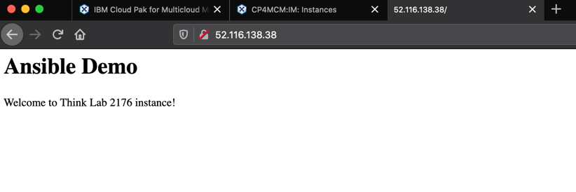

  Congratulations! You have just provisioned new service in public cloud with terraform template and configured it with Ansible task.

***

## Verifying new instances


***

## Summary

