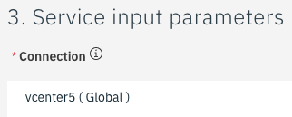
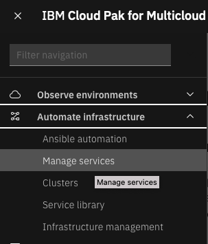
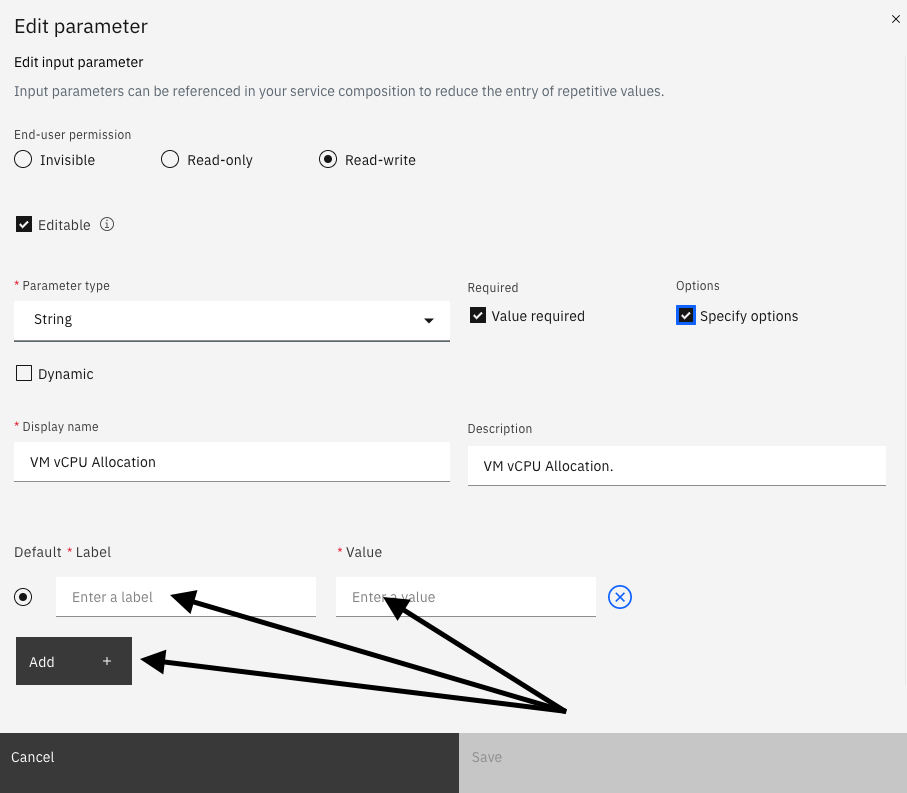

# Automation with VMware2

In this exercise you will learn about the service library and how to use Terraform and other integrations to automate tasks within a VMware environment.  We'll begin by using an existing Service to provision a Virtual Machine.  Next, we'll learn how to modify the Service and explore some of the other capabilities such as the service composer.  Finally, you'll learn how to publish the service into the service library so that end users can run your service.  

Begin by selecting the hamburger menu in the upper left corner

From the dropdown menu, select "Automate Infrastructure" and then "Service Library

The Service Library is where a typical end-user would go to take advantage of the automations that other users have created. These users don't need administrative rights or knowledge of Terraform, but can take advantage of the automation capabilities.  You will noticed that the services are organized into categories such as Virtual Machine and Cluster Lifecycle Services.  These services are a small subset of the services that are provided out of the box with the solution. These are the ones that have been published where your user account has been granted access.

We will begin by deploying a single virtual machine into VMware.

- Find the service named "Think Lab VMware"

- Double click on the box

- Click "Next" to execute the service: 

- This screen contains a list of parameters that are required to provision a virtual machine into VMware.  It is possible to expose other parameters such as the VMware Datastore, VMware Cluster, etc. but we intentionally want to keep this simple
  for the end user.

- Select a namespace of "thinklabs" for the VM.  CP4MCM always associates resources with a project/namespace.  The namespace can be used to restrict permissions for the provisioned resource.
  

- Next specify a service instance. This is the name of the service being provisioned.  You can use this service instance to perform maintenance and delete the service.  For this lab, specify your username as the service name to ensure we have a unique service instance name
  

- Select an Environment for your VM (Development, QA, etc.).  Any value is fine for the lab.

- Select a Connection.  In this lab, you will see vcenter3 and vcenter5.  These are the two vCenter environments where virtual machines can be provisioned.  You can select either vCenter environment.

- Assign a name to your virtual machine.   This name becomes the hostname of the virtual machine.  The default value is "demovm".  Change this to your username to ensure that we don't have any naming conflicts.

- Select the vSphere Inventory Definition. Again, you can select either vcenter3 or vcenter5, but the value you specify should match the vCenter server you specified 2 steps ago.

- In the next field, you will specify the memory for the VM.  We recommend leaving this at 1024 to conserve resource on vCenter.  Note that it is possible to make this a dropdown list with values like 1, 2,4, 8, 16

- Specify the VM vCPU Allocation.  This is the number of virtual CPUs assigned to the VM.  Specify 1 or 2 CPUs.  This field could also be a dropdown list with min and max numbers of CPUs.

- Finally specify the disk space for the virtual machine. This VMware template requires a minimum of 25 Gig of disk space.  Please do NOT specify more than 50 Gig of space to conserve disk space in the vCenter environment.

- You are now ready to deploy your virtual machine.  Click the "Deploy" button to begin the provisioning process.

- At this point, a dialog will open indicating that your order has been submitted. There are two buttons on the dialog.  Click on the "Go to Instances" button and you can watch the logs as your virtual machine is provistioning.

- You will see a list of deployed instances.  Search for your username in the list

- Click on the "name" of the service.  In the example, click on "student37"

- You will be taken to a page where you can see a summary of the deployment.  It may say that the deployment is completed or may say that it is in progress or even failed. 

- On this page, you'll see a tab at the top for "Log file" or a link on the right labeled "view log".  Click on either one of those to view the logs.

- This log shows you all of the steps that Terraform performed in order to deploy the virtual machine.  You should see a message at the end of the log indicating success

- You have now successfully provisioned a virtual machine via the service library.

## Explore and Modify a Service

Now let's take a look at how the service was created.  We'll show you how to modify a service and add more capabilities.  And, we'll show you how to publish the service to the service library so that other users can run your service.

- Select the hamburger menu in the upper left corner

- From the dropdown, select "Automate Infrastructure" and then "Manage Services"

- The first time you do this, you will be taken to the "welcome" page

  The welcome page is used to setup the initial steps to setup the services. These steps include setting up the cloud and vCenter connections, creating Terraform templates, and then creating a service.  These initial steps have already been performed in this environment.  Click on the "Service library" link or go to the hamburger menu and select Library->Services.

- You are now looking at the Manage service library.  Here, you'll see a number of Terraform based services that are provided
  with the product.  These services can be used to provision virtual machines, provision cloud services, perform cluster
  lifecycle management, install middleware, and more.  There is also an example template that includes an approval process. 
  This allows you to require an approval before resources are provisioned.

- Scroll down and view the services that exist.

- Locate the "Think Lab VMware" service.  This is the service that you just provisioned via the Service Library.

- You are going to make a copy of this service so that you can make modifications without impacting other users.  

- Click the 3 dots on the right side and then select "Duplicate"

- A dialog will open.  At the bottom of the dialog you will see a name that was automatically populated with "Copy of Think Lab VMware".   Change the name to a name that begins with your username. For example, "student37 VMware service".  Then, click the "Duplicate" button.

- You are now in the editor for your service.
- You'll notice that the current version is 3.0.0.0.  It is possible to create additional versions and be working on multiple versions simultaneously.  Or, have one version that is published and a newer version that is under development.  We'll work with version 3.0.0.0.
- Scroll down to the bottom of the page.  Here, you can see the GitHub link to where the Servie definition is stored and the prerequisites.

- At the top of the page, click on the Parameters tab. You'll see a list of input parameters that are used for this service.

- Let's learn how to modify one of the input parameters to improve the service.   Select the 3 virtical dots on the right side for eh vm_cpu input parameter.  A dialog will open with the existing definition.  You'll notice that the default value of 1 virtual CPU is already populated.  There are also validation rules that can be specified.

- To improve the service, let's change the vCPU to a dropdown list.  Click on the "Specify options" checkbox as shown above.  The dialog will change and you'll see options to edit labels and values.

- Populate the label and values fields and use the "Add" button to add 3 or 4 rows of options (1, 2, 4, 8 CPUs).   The dialog should look like the screen below.  Then, click the Save.

## Explore Composition

Now, let's explore the Composition user interface.  You can use the Composition UI to build complex workflows via a drag and drop set of capabilities.  Let's begin be exploring some existing services.  Later, you'll learn to build your own.

- Click the link in the top left labeled "Service Library" to return to the list of available services

- At the top of the screen type "MEAN" into the search bar to filter the least of services

- You will see a service titled "Mult Cloud - MEAN Stack deployment"
- Click on the down arrow to expand the service.  Here is where you will see the versions of the service that exist.  You can only edit and deploy a specific version of the service.

- Then, click the 3 dots on the right that are specific to the 2.4.0.0 version and select edit. 

- You are now editing version 2.4.0.0 of the MEAN Stack deployment.
- Click on the "Composition" tab

- If you look at this Composition, you'll notice that the first item on the left is a "Decision" on which Cloud you want to deploy to.  If you were to deploy this service, you would be given the option to deploy to VMware, the IBM Cloud, AWS, or Azure.
- After selecting a Cloud, the service would use the appropriate Terraform template to deploy the MEAN Stack.
- You can see each of the 4 clouds listed vertically and there is a Terraform template for each.
- After the Mean stack is provisioned to the selected Cloud, the Composition flow next registers the system in a ServiceNow CMDB.
- Finally, an Email is sent indicating the provisioning is complete.

- Click on the SNow CMDB icon

- You'll notice that information will be populated on the right side of the screen.  Here you can see the Basic information that describes the Terraform template that you selected.
- Click on the "Parameters" tab that is just to the right of the "Basic Information" tab.

- You can see the input parameters that will be passed into the CMDB.  
- Let's examine the other components that can be added to a service composition.  If you look on the left side, you'll notice different categories of objects that can be added to the service.  As you examine the content on the left, you'll notice Decision flows, E-mail Notification, Rest Hook, other Terraform templates, and Ansible Tower templates.  

- Select the "Demo Job Template" Ansible Tower template and drag it over to the Composition area.  As you drag the Ansible Tower template, you'll notice that boxes appear on the composition screen.  You can drop the template on any one of the boxes.   After a few seconds that Ansible Tower template will appear on the screen.  In order to make this functional, you would need to define Parameters to pass.   We won't here, but you can do that via the "IBM Cloud Automation" portion of the lab.

- Click on "<- Service Library" to navigate back to the main page.  A dialog will open.  Click Continue so that your changes won't be saved.

## Executing Terraform templates directly
- There is tremendous value in building and executing Services within the Cloud Pak.   But sometimes you just want to execute a Terraform template.  If you click on the "Terraform templates" tab at the top of the screen, you will see a list of available templates

- If you click on the icon next to the "Import Template" button, you can filter the templates:  
- Select the icon, then check the "VMware vSphere" checkbox and you'll see a list of templates that can be run in a VMware environment

- There are two advantages of executing a Terraform template directly:
    - First, you may have access to parameters that are not exposed in the Service.  For example, maybe you want to provision to a different vSphere Cluster.
    - Second, occasionally you will run into cases where the Terraform template runs correctly, but the service doesn't.  It is a good debug tool.  First confirm that your Terraform Template can be deployed.  Then, debug the Service.

## Publishing Your Service to the Service Library

- You have modified your Service and changed the menus.  Now, let's make it available to end users via the Service Library.
- Click back on the "Services tab of the Manage service library

- Find your service "studentxx VMware service"
- When publishing a service, you must publish a specific version of your service.
- Expand your template by clicking on the dropdown arrow on the left.

- On the right side, click on the 3 vertical dots for versoin 3.0.0.0 and select "Publish"

- A dialog opens and asks to confirm whether you want to publish vesrion 3.0.0.0.

- Click "Publish"
- A dialog will open indicating that the Service has been published.  Click the "Close" button to close the dialog.

- The next step is to assign permissions to your newly published service.   At the top level of your Service, click on the 3 vertical dots on the right and select "Assign access"

- A dialog opens with a list of namespaces.  Permissions for the service library is done at the namespace level.  You will select the namespaces that you want to give permissions to.  Your user account has permissions to the vmware namespace, so check that checkbox.

- Then, click the "Assign" button at the bottom of the dialog.
- A dialog opens indicating that the assignment was successful.  Click "Close"

- Click on "Return to main navigation"

- Select the hamburger menu in the top left:  Then select Automate Infrastructure -> Service library

- Notice that your service "studentXX VMware service" shows up in the Service Library

That completes this section of the lab. 

In this portion of the lab, you saw how easy it is for an end user to provision complex services that can provision virtual machine, clusters, install applications, and more.  You learned how to modify and customize a service.  You explored the capabilities within the service composer which allows you to combine Terraform, Ansible, Rest Hooks, ServiceNow, and more into complex workflows.  Finally, you learned how to publish your Service so that other users can execute the Service and provision VMware virtual machines.
