# Automation with VMware

In this exercise you will learn about the service library and how to use Terraform and other integrations to automate tasks within a VMware environment.  We'll begin by using an existing Service to provision a Virtual Machine.  Next, we'll learn how to modify the Service and explore some of the other capabilities such as the service composer.  Finally, you'll learn how to publish the service into the service library so that end users can run your service.  

1) Begin by selecting the hamburger menu in the upper left corner
  

2) From the dropdown menu, select "Automate Infrastructure" and then "Service Library
  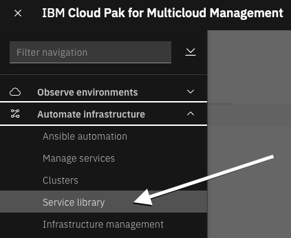

  In case you access this module for the first time, "Welcome" screen may pop-up. If that happens, click the **Service library** link.
  
  

The Service Library is where a typical end-user would go to take advantage of the automations that other users have created. These users don't need administrative rights or knowledge of Terraform, but can take advantage of the automation capabilities.  You will noticed that the services are organized into categories such as Virtual Machine and Cluster Lifecycle Services.  These services are a small subset of the services that are provided out of the box with the solution. These are the ones that have been published where your user account has been granted access.

We will begin by deploying a single virtual machine into VMware.

3) Find the service named "Think Lab VMware"
  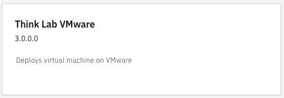

4) Double click on the box

5) Click "Next" to execute the service: 

This screen contains a list of parameters that are required to provision a virtual machine into VMware.  It is possible to expose other parameters such as the VMware Datastore, VMware Cluster, etc. but we intentionally want to keep this simple for the end user.

6) Select a namespace of "vmware" for the VM.  CP4MCM always associates resources with a project/namespace.  The namespace can be used to restrict permissions for the provisioned resource.
  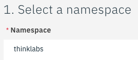

7) Next specify a service instance. This is the name of the service being provisioned.  You can use this service instance to perform maintenance and delete the service.  For this lab, specify your username as the service name to ensure we have a unique service instance name
  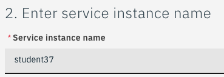

8) Select an Environment for your VM (Development, QA, etc.).  Any value is fine for the lab.
  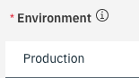

9) Assign a name to your virtual machine.   This name becomes the hostname of the virtual machine.  The default value is "demovm".  Change this to your username to ensure that we don't have any naming conflicts.
  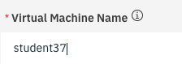

10) In the next field, you will specify the memory for the VM.  We recommend leaving this at 1024 to conserve resource on vCenter.  Currently, we have the service setup to allow only the values of 1024 or 2048.   If you specify a different value, you'll get a warning.
  

11) Specify the VM vCPU Allocation.  This is the number of virtual CPUs assigned to the VM.  Specify 1 or 2 CPUs.  There is data validation that will only allow you to specify 1, 2, or 4 CPUs.  Later in the lab, you'll learn how to convert this to a dropdown list containing 1,2,4, and 8 CPUs.
  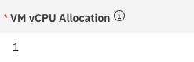

12) Finally specify the disk space for the virtual machine. This VMware template requires a minimum of 25 Gig of disk space.  There is data validation that will only allow you to specify between 25 and 39 Gig of disk space.
  

13) You are now ready to deploy your virtual machine.  Click the "Deploy" button to begin the provisioning process.
  

14) At this point, a dialog will open indicating that your order has been submitted. There are two buttons on the dialog.  Click on the "Go to Instances" button and you can watch the logs as your virtual machine is provistioning.
  

15) You will see a list of deployed instances.  Search for your username in the list
  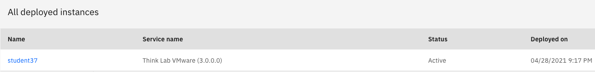

16) Click on the "name" of the service.  In the example, click on "student37"

17) You will be taken to a page where you can see a summary of the deployment.  It may say that the deployment is completed or may say that it is in progress or even failed. 
  

18) On this page, you'll see a tab at the top for "Log file" or a link on the right labeled "view log".  Click on either one of those to view the logs.
  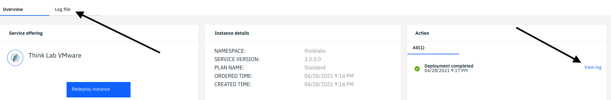

19) This log shows you all of the steps that Terraform performed in order to deploy the virtual machine.  You should see a message at the end of the log indicating success
  

  You have now successfully provisioned a virtual machine via the service library.

20) Note:  You can also Terminate and Delete the virtual machine you provisioned.  Normally, you terminate the VM first.  Then you delete the VM.  This is an optional step for the lab. If you want to see how the termination and deletion works, go to the 3 dots in the upper right corner:
  
   - Select Terminate
   - Wait for the Terminate to complete.  Then, select Delete

You have now successfully deployed a virtual machine into VMware and optionally deleted the virtual machine.

***

## Explore and Modify a Service

Now let's take a look at how the service was created.  You'll learn how to modify a service and add more capabilities.  And, learn how to publish the service to the service library so that other users can run your service.

1) Select the hamburger menu in the upper left corner
  

2) From the dropdown, select "Library" and then "Services"

3) The first time you do this, you will be taken to the "welcome" page.  If not, you will be taken directly to the list of Services that are installed in the environment and you can proceed to step 4)
  

  The welcome page is used to setup the initial steps to setup the services. These steps include setting up the cloud and vCenter connections, creating Terraform templates, and then creating a service.  These initial steps have already been performed in this environment.  Click on the "Service library" link or go to the hamburger menu and select Library->Services.
  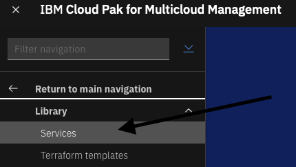

  You are now looking at the Manage service library.  Here, you'll see a number of Terraform based services that are provided
  with the product.  These services can be used to provision virtual machines, provision cloud services, perform cluster
  lifecycle management, install middleware, and more.  There is also an example template that includes an approval process. 
  This allows you to require an approval before resources are provisioned.

4) Scroll down and view the services that exist.  Or, use the catagories on the left to filter the services
  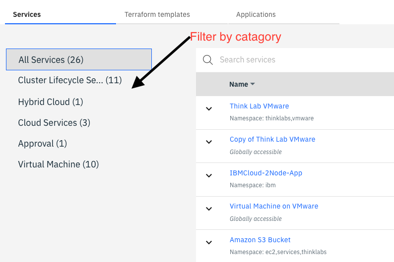

5) Locate the "Think Lab VMware" service.  This is the service that you just provisioned via the Service Library.

6) You are going to make a copy of this service so that you can make modifications without impacting other users.  

7) Click the 3 dots on the right side and then select "Duplicate"
  

8) A dialog will open.  At the bottom of the dialog you will see a name that was automatically populated with "Copy of Think Lab VMware".   Note:  you may have to scroll down within the dialog in order to see the "Name" field.  Change the name to a name that begins with your username. For example, "student37 VMware service".  Then, click the "Duplicate" button.

  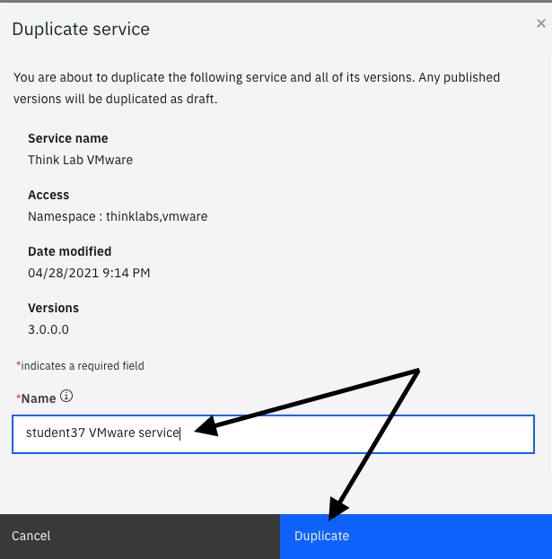

  You are now in the editor for your service.

  You'll notice that the current version is 3.0.0.2.  It is possible to create additional versions and be working on multiple versions simultaneously.  Or, have one version that is published and a newer version that is under development.  We'll work with version 3.0.0.2.

9) Scroll down to the bottom of the page.  Here, you can see the GitHub link to where the Service definition is stored and the prerequisites.
  

10) At the top of the page, click on the Parameters tab. You'll see a list of input parameters that are used for this service.
  

11) Let's learn how to modify one of the input parameters to improve the service.   Select the 3 vertical dots on the right side for the vm_cpu input parameter.
  

  A dialog will open with the existing definition.  You'll notice that the default value of 1 virtual CPU is already populated.  There are currently data validation rules that limit the CPUs to 1, 2, or 4.
  

12) Remove the Validation Rule and Validation rule description
  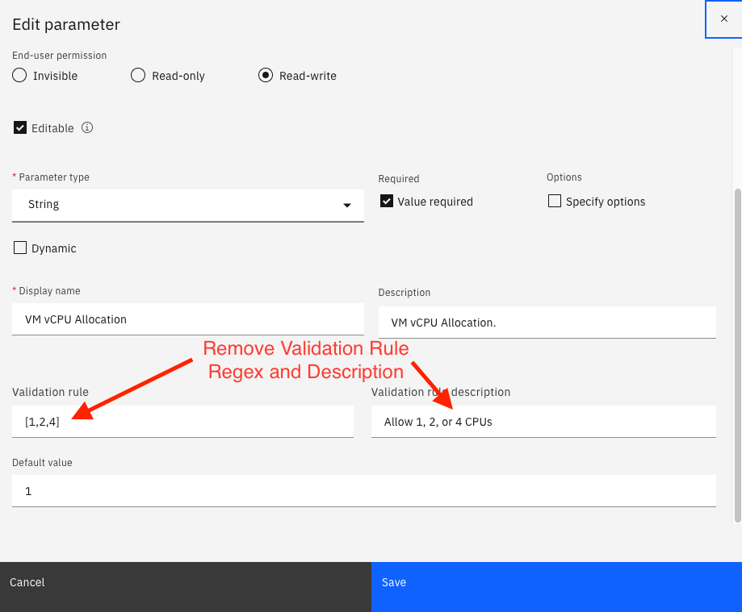

13) To improve the service, let's change the vCPU to a dropdown list.  Click on the "Specify options" checkbox (1) as shown above.  The dialog will change and you'll see options to edit labels and values.
  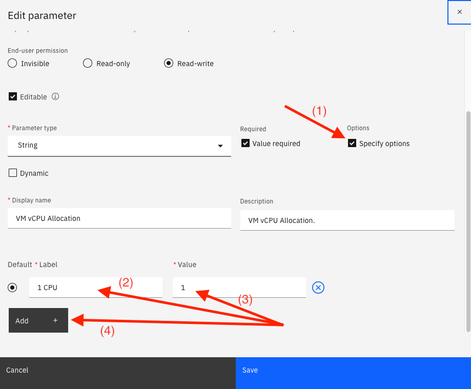

14)  Populate the label field with "1 CPU" and values field with "1" and use the "Add" button to add 3 more rows of options.  Populate the rows with (1, 2, 4, 8 CPUs).  Leave 1 CPU as the default value (see the raio button)  The dialog should look like the screen below.  Then, click the Save.
  

15) Finally, click Save in the upper right corner to save your Service
  

16) Now try a "Test Deploy" of the Service to see how your new dropdown list behaves.  To see the diaglog, click the 3 vertical dots in the upper right corner.  Then, select "Test Deploy" as seen below.
  

17) Click the "Next" button in the lower right corner:  
  

18) Now, view the dropdown list for the VM vCPU Allocation.
  

At this point, we aren't going to actually deploy the service.  We'll continue on to the next section of the lab.

You have now explored and modified a service.  The next step is to explore the Composition user interface.

***

## Explore Composition

Now, let's explore the Composition user interface.  You can use the Composition UI to build complex workflows via a drag and drop set of capabilities.  Let's begin be exploring some existing services.  Later, you'll learn to build your own.

1) Click the link in the top left labeled "Service Library" to return to the list of available services
  

You should see a list of the available services.

3) At the top of the screen type "MEAN" into the search bar to filter the least of services
  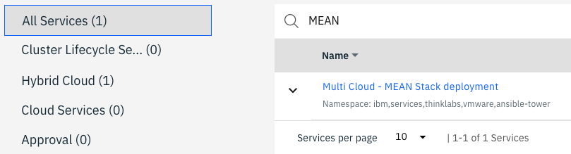

  You will see a service titled "Mult Cloud - MEAN Stack deployment"

4) Click on the down arrow to expand the service.  Here is where you will see the versions of the service that exist.  You can only edit and deploy a specific version of the service.
  

5) Then, click the 3 dots on the right that are specific to the 2.4.0.0 version and select edit. 
  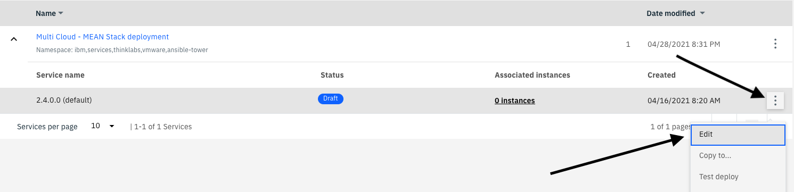

  You are now editing version 2.4.0.0 of the MEAN Stack deployment.

6) Click on the "Composition" tab
  

7) Examine the Composition.  The first item on the left is a "Decision" where a user gets to choose the cloud where the service will be deployed.  If you were to deploy this service, you would be given the option to deploy to VMware, the IBM Cloud, AWS, or Azure.
  - After selecting a Cloud, the service would use the Terraform template for the selected Cloud to deploy the MEAN Stack.
  - You can see each of the 4 clouds listed vertically and there is a Terraform template for each.
  - After the Mean stack is provisioned to the selected Cloud, the Composition flow next registers the system in a ServiceNow CMDB.
  - Finally, an Email is sent indicating the provisioning is complete.
  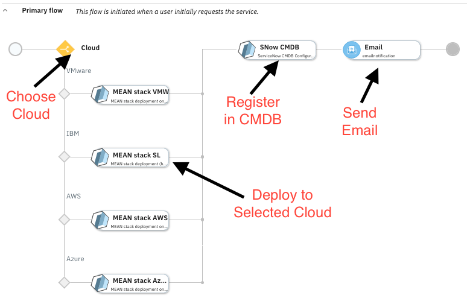

8) Click on the SNow CMDB icon
  

  You'll notice that information will be populated on the right side of the screen.  Here you can see the Basic information that describes the Terraform template that you selected.

9)  Click on the "Parameters" tab that is just to the right of the "Basic Information" tab.
  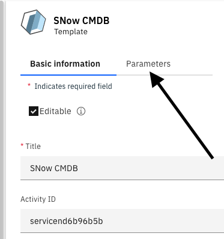
  
  
  - You can see the input parameters that will be passed into the CMDB.  
  
  
  
  - Let's examine the other components that can be added to a service composition.  If you look on the left side, you'll notice different categories of objects that can be added to the service.  As you examine the content on the left, you'll notice Decision flows, E-mail Notification, Rest Hook, other Terraform templates, and Ansible Tower templates.  
  

10) As shown above, select the "Demo Job Template" Ansible Tower template and drag it over to the Composition area.  As you drag the Ansible Tower template, you'll notice that boxes appear on the composition screen.  You can drop the template on any one of the boxes.   After a few seconds that Ansible Tower template will appear on the screen.  In order to make this functional, you would need to define Parameters to pass between components of the service composition.   We won't do that in this portion of the lab.  The "IBM Cloud Automation" portion of the lab will go into a little more detail.
  

11) Click on "<- Service Library" in the upper left corner to navigate back to the main page.  

12) A dialog will open.  Click Continue so that your changes won't be saved.

You have now seen how the Service Composition user interface can help you build complex automations via drag and drop capabilities.

***

## Executing Terraform templates directly

There is tremendous value in building and executing Services within the Cloud Pak.   But sometimes you just want to execute a Terraform template.  

1) Click on the "Terraform templates" tab at the top of the screen and you will see a list of available templates
  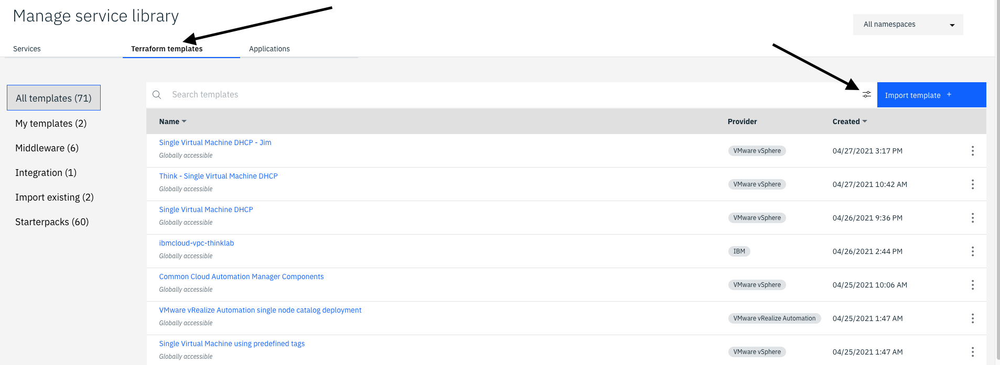

2) Click on the icon next to the "Import Template" button.  This allows you to filter the templates:  
  

3) Select the icon, then check the "VMware vSphere" checkbox and you'll see a list of templates that can be run in a VMware environment
  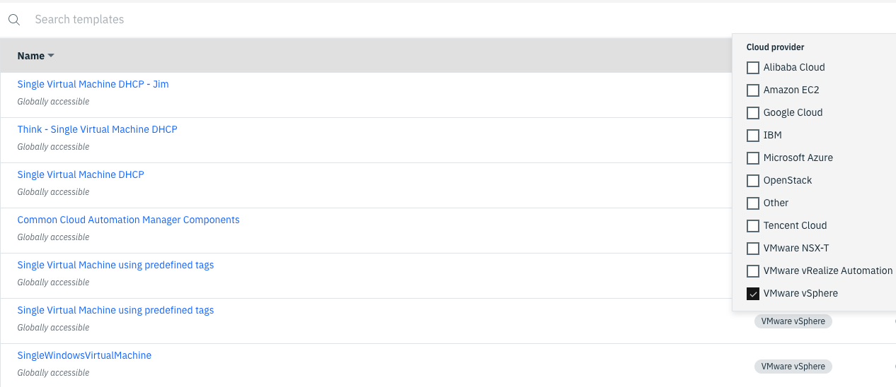

  There are two advantages of executing a Terraform template directly:
  - First, you will have access to parameters that are not exposed in the Service.  For example, maybe you want to provision to a different vSphere Cluster.
  - Second, occasionally you will run into cases where the Terraform template runs correctly, but the service doesn't.  It is a good debug tool.  A good development practice is to first deploy and debug the Terraform template until it successfully deploys.  Then, deploy and debug the Service until it deploys successfully.

***

## Publishing Your Service to the Service Library

You have modified your Service and changed the menus.  Now, let's make it available to end users via the Service Library.

1) Click back on the "Services tab of the Manage service library
  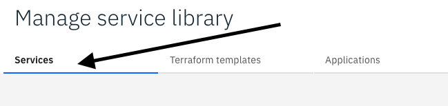

2) Find your service "studentxx VMware service"

  When publishing a service, you must publish a specific version of your service.

3) Expand your template by clicking on the dropdown arrow on the left.
  

4) On the right side, click on the 3 vertical dots for versoin 3.0.0.2 and select "Publish"
  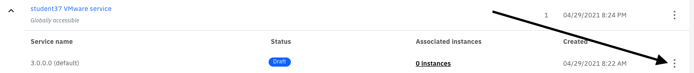

  A dialog opens and asks to confirm whether you want to publish vesrion 3.0.0.2.
  

5) Click "Publish"

6) A dialog will open indicating that the Service has been published.  Click the "Close" button to close the dialog.
  

7) The next step is to assign permissions to your newly published service.   At the top level of your Service, click on the 3 vertical dots on the right and select "Assign access"
  

8) A dialog opens with a list of namespaces.  Permissions for the service library is done at the namespace level.  You will select the namespaces that you want to give permissions to.  Your user account has permissions to the vmware namespace, so check that checkbox.

9) Then, click the "Assign" button at the bottom of the dialog.

10) A dialog opens indicating that the assignment was successful.  Click "Close"
  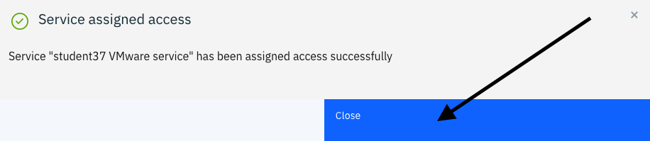

11) Click on "Return to main navigation"
  

12) Select the hamburger menu in the top left.
   
  

13) Then select Automate Infrastructure -> Service library
  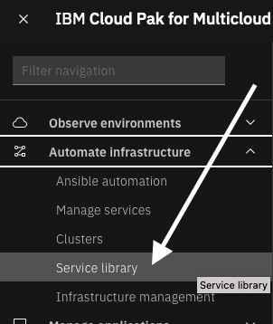

  Notice that your service "studentXX VMware service" shows up in the Service Library
  

You have now completed the section of the lab on automating tasks in VMware environments.

In this portion of the lab, you saw how easy it is for an end user to provision complex services that can provision virtual machine, clusters, install applications, and more.  You learned how to modify and customize a service.  You explored the capabilities within the service composer which allows you to combine Terraform, Ansible, Rest Hooks, ServiceNow, and more into complex workflows.  Finally, you learned how to publish your Service so that other users can execute the Service and provision VMware virtual machines.

To continue other portions of the lab, select one of the lab exercises in the upper left corner or select one of the images below.

<Row>

<Column colLg={3} colMd={3} noGutterMdLeft>
<ArticleCard
    color="dark"
    subTitle="Automation with the Public Cloud"
    title="Want to learn how to automate infrastructure management in Public clouds?"
    href="/tutorials/ibmcloud"
    actionIcon="arrowRight"
    >

</ArticleCard>
</Column>

<Column colLg={3} colMd={3} noGutterMdLeft>
<ArticleCard
    color="dark"
    subTitle="Managing chargeback"
    title="Do you want to create and execute a chargeback report on the VM and container workloads?"
    href="/tutorials/Chargeback"
    actionIcon="arrowRight"
    >

</ArticleCard>
</Column>

<Column colLg={3} colMd={3} noGutterMdLeft>
<ArticleCard
    color="dark"
    subTitle="Managing SRE console access"
    title="Do you want to learn how to provide SRE secure terminal access to Virtual Machines?"
    href="/tutorials/Console_Access"
    actionIcon="arrowRight"
    >

</ArticleCard>
</Column>
</Row>

***
