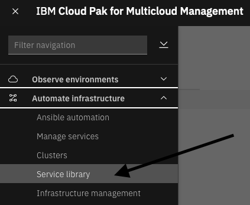

# Automation with VMware

In this exercise you will learn about the service library and how to use Terraform and other integrations to automate tasks within a VMware environment.  Will begin by using an existing "Managed Service" to provision a Virtual Machine.  Then you'll learn how to publish the service into the service library so that end users can run your service.  As an administrator, you'll have more capabilities than a typical end user.  Finally, we'll explore some of the other capabilities where you can leverage the power of combining Terraform, Ansible Tower, resthooks and other integrations to via our service composer to accomplish complex tasks.

Begin by selecting the hamburger menu in the upper left corner

From the dropdown menu, select "Automate Infrastructure" and then "Service Library

The Service Library is where a typical end-user would go to take advantage of the automations that other users have created. These users don't need administrative rights or knowledge of Terraform, but can take advantage of the automation capabilities.  You will noticed that the services are organized into categories such as Virtual Machine and Cluster Lifecycle Services.  These services are a small subset of the services that are provided out of the box with the solution. These are the ones that have been published for the permissions that your user account has access to.

We will begin by deploying a single virtual machine into VMware.

- Find the service named "Think Lab VMware"

- Double click on the box
- Click "Next" to execute the service: 
- This screen contains a list of parameters that are required to provision a virtual machine into VMware.  It is possible to expose other parameters such as the VMware Datastore, VMware Cluster, etc. but we intentionally want to keep this simple
  for the end user.
- Select a namespace of "thinklabs" for the VM.  CP4MCM always associates resources with a project/namespace.  The namespace can be used to restrict permissions for the provisioned resource.
  
- Next specify a service instance. This is the name of the service being provisioned.  You can use this service instance to perform maintenance and delete the service.  For this lab, specify your username as the service name to ensure we have a unique service instance name
  
- Select an Environment for your VM (Development, QA, etc.).  Any value is fine for the lab.

- Select a Connection.  In this lab, you will see vcenter3 and vcenter5.  These are the two vCenter environments where virtual machines can be provisioned.  You can select either vCenter environment.

- Assign a name to your virtual machine.   The default value is "demovm".  Change this to your username to ensure that we don't have any naming conflicts.

- Select the vSphere Inventory Definition. Again, you can select either vcenter3 or vcenter5

- In the next field, you will specify the memory for the VM.  We recommend leaving this at 1024 to conserve resource on vCenter.  Note that it is possible to make this a dropdown list with values like 1, 2,4, 8, 16

- Specify the VM vCPU Allocation.  This is the number of virtual CPUs assigned to the VM.  Specify 1 or 2 CPUs.  This field could also be a dropdown list with min and max numbers of CPUs.

- Finally specify the disk space for the virtual machine. This VMware template requires a minimum of 25 Gig of disk space.  Please do NOT specify more than 50 Gig of space to conserve disk space in the vCenter environment.

- You are now ready to deploy your virtual machine.  Click the "Deploy" button to begin the provisioning process.

- At this point, a dialog will open indicating that your order has been submitted. There are two buttons on the dialog.  Click on the "Go to Instances" button and you can watch the logs as your virtual machine is provistioning.

- You will see a list of deployed instances.  Search for your username in the list

- Click on the "name".  In the example, click on "student37"
- You will be taken to a page where you can see a summary of the deployment.  It may say that the deployment is completed or may say that it is in progress or even failed. 

- On this page, you'll see a tab at the top for "Log file" or a link on the right labeled "view log".  Click on either one of those to view the logs.

- This log shows you all of the steps that Terraform performed in order to deploy the virtual machine.  You should see a message at the end of the log indicating success

- You have now successfully provisioned a virtual machine via the service library.

## Section

Now let's take a look at how the service library was created.  We'll show you how to modify a service and add more capabilities.  And, we'll show you how to publish the service to the service library so that other users can run your service.

- Select the hamburger menu in the upper left corner

- From the dropdown, select "Automate Infrastructure" and then "Manage Services"

Normally, you would use the welcome page to setup your VMware connections, create a Terraform template, and build a service.
In this lab, we have already done some of those steps.  Connections to VMware vCenter already exist and we are going to begin
with a pre-defined Terraform template.

- Click on the "Service Library" URL in step 3 as seen in previous picture.  Or, you can use the hamburger menu to Navigate
  to Library->Services
  

- You are now looking at the Manage service library.  Here, you'll see a number of Terraform based services that are provided
  with the product.  These services can be used to provision virtual machines, provision cloud services, perform cluster
  lifecycle management, install middleware, and more.  There is also an example template that includes an approval process. 
  This allows you to require an approval before resources are provisioned.

- Explore a few of the services.  On each of the services, you'll a description in the upper left corner.  There is also and
  link in the upper left corner named "Service library" that will take you back to the main service library page.

- When you are done exploring the services, click on the "Service library" link to navigate back to the main service library page.

## Section

We will begin by deploying a virtual machine to VMware.  This use interface is not what a typical end-user would use.  We'll 